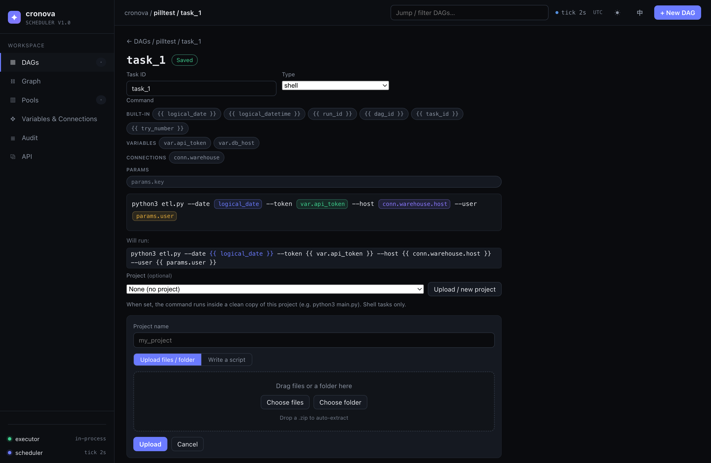
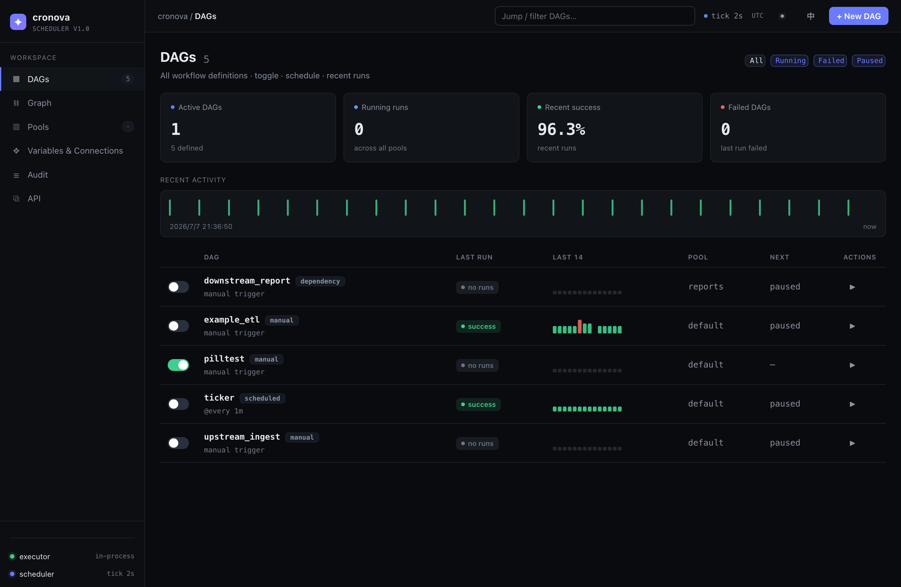
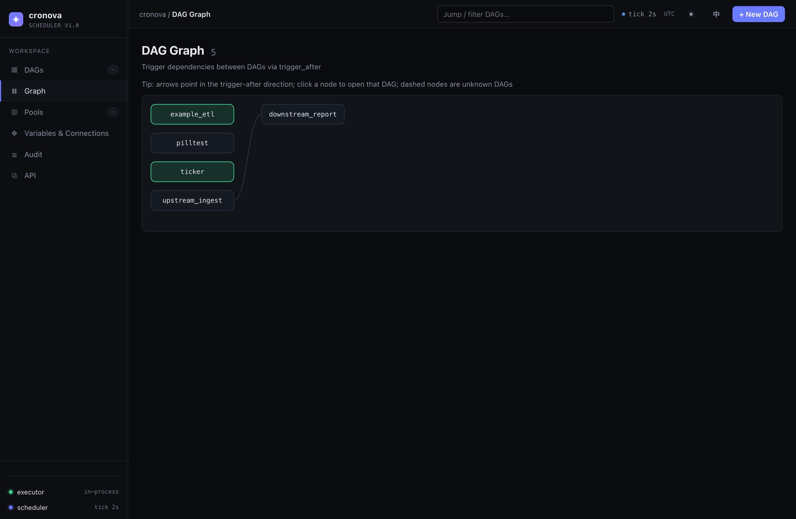

<div align="center">

# cronova

**A lightweight, self-hosted workflow scheduler in a single Go binary — an open-source [Apache Airflow](https://airflow.apache.org/) / Azkaban alternative you can install with one command.**

[](https://github.com/zoyluoblue/cronova/releases/latest)
[](LICENSE)
[](go.mod)
[](docs/DEPLOY.md)

**English** · [简体中文](README.zh-CN.md)

</div>

cronova is a **workflow scheduler and job orchestrator** in the spirit of Airflow and Azkaban, built for teams who want DAG-based scheduling **without the operational weight**. It ships as **one static Go binary** with an **embedded SQLite** database — no JVM, no Python runtime, no external database, no message broker, no containers required. Install it on any Linux or macOS box with a single command, define your pipelines, and open the built-in web console.

<div align="center">
  
  <br><em>The console task editor: build commands with click/drag variable pills (built-in, variables, connections, params).</em>
</div>

```bash
# Install the scheduler + web console + native service on Linux or macOS, in one line:
curl -fsSL https://raw.githubusercontent.com/zoyluoblue/cronova/main/deploy/bootstrap.sh | sudo bash
```

## Why cronova?

- 🟢 **Single binary, zero dependencies.** Pure-Go build (`modernc.org/sqlite`, CGO-free), embedded database, one process. `curl | bash` to install, `cronova update` to upgrade, `cronova uninstall` to remove — no Airflow-style stack to babysit.
- 🗂️ **Airflow / Azkaban-style DAGs.** Declarative YAML DAGs with dependency edges, cron / `@every` schedules, cross-DAG triggers, catchup / backfill, per-task retries & timeouts, resource pools, and trigger rules — the orchestration primitives you already know.
- 🌐 **Polyglot tasks + project upload.** Every task runs as an OS subprocess, so write tasks in **shell, Python, SQL, a JAR, or HTTP** — any language on the host. Drag-and-drop a script, a whole project folder, or a `.zip` in the console and cronova runs it in an isolated working copy.
- 🤖 **AI-native.** A built-in **[Model Context Protocol (MCP)](https://modelcontextprotocol.io/) server** and a remote JSON CLI let AI agents (Claude, and any MCP client) list, create, validate, trigger, and inspect DAGs through the same token-authenticated, role-gated API.
- 🛡️ **Crash-recoverable execution.** Run tasks in a decoupled gRPC executor so restarting or upgrading the scheduler never kills running jobs — on recovery it re-attaches to in-flight tasks with no double execution.
- 🖥️ **Batteries-included web console.** DAG dashboard, run history, task states, **live log tailing (SSE)**, manual triggers, variables & connections, an audit trail, and a visual command editor — all served in-process. REST API + OpenAPI included.

## What is cronova?

**cronova is an open-source, self-hosted workflow scheduler** (a.k.a. job scheduler / task orchestrator / DAG scheduler) written in Go. It schedules **DAGs** — directed acyclic graphs of tasks — on cron or interval triggers, runs each task as a subprocess using the host's own interpreters, and gives you a web console, a REST API, a CLI, and an MCP endpoint for AI agents. Think of it as a **cron replacement with dependencies, retries, backfill, and observability**, or a **lightweight Airflow alternative** that fits in one binary.

## Quick start

```bash
# 1. Build (Go 1.26+) — or grab a prebuilt binary from Releases
go build -o cronova ./cmd/cronova

# 2. Start the scheduler + web console (in-process executor)
./cronova serve                 # console at http://localhost:8090

# 3. Drive it from the CLI (in another terminal)
./cronova dags                  # list DAGs from ./dags
./cronova trigger example_etl   # run a DAG now
./cronova runs example_etl      # run history + task states
```

Open **http://localhost:8090** for the console — DAG list, run history, task states, live logs, and one-click manual triggers.

<div align="center">
  
</div>

## cronova vs. Airflow vs. Azkaban vs. cron

| | **cronova** | Apache Airflow | Azkaban | plain cron |
|---|:---:|:---:|:---:|:---:|
| Install | **one binary / `curl \| bash`** | Python stack + DB + broker | JVM + MySQL | built-in |
| Runtime deps | **none** (embedded SQLite) | Python, Postgres, Redis/Celery | Java, MySQL | none |
| DAGs & dependencies | ✅ | ✅ | ✅ | ❌ |
| Cron + interval + cross-DAG triggers | ✅ | ✅ | partial | cron only |
| Catchup / backfill | ✅ | ✅ | ❌ | ❌ |
| Retries, timeouts, pools | ✅ | ✅ | partial | ❌ |
| Crash recovery (no double-run) | ✅ | ✅ | partial | ❌ |
| Polyglot tasks (shell/Python/SQL/JAR/HTTP) | ✅ | ✅ (operators) | JVM-centric | any (no orchestration) |
| Web console + live logs | ✅ | ✅ | ✅ | ❌ |
| REST API + OpenAPI | ✅ | ✅ | partial | ❌ |
| AI agent / MCP integration | ✅ **built-in** | ❌ | ❌ | ❌ |
| Footprint | **~single process, tens of MB** | heavy | heavy (JVM) | tiny |

cronova targets the sweet spot between a bare `crontab` and a full Airflow deployment: **real DAG orchestration with almost no operational overhead.**

## Define a DAG

Drop a YAML file in `./dags/` (see [`dags/`](dags/) for runnable examples):

```yaml
dag_id: daily_etl
schedule: "0 2 * * *"        # cron; or "@every 30s"; omit for manual-only
start_date: 2026-06-01
catchup: true                # backfill missed periods
max_active_runs: 1
default_retries: 2
tasks:
  - id: extract
    type: shell
    command: "python extract.py --date {{ logical_date }}"
    pool: default
  - id: transform
    command: "python transform.py --date {{ logical_date }}"
    deps: [extract]
  - id: load
    command: "psql -f load.sql"
    deps: [transform]
    retries: 3
    timeout: 1800
trigger_after:               # optional: run after another DAG succeeds
  - dag_id: upstream_ingest
```

**Template variables** work in any command, URL, header, body, or query:
`{{ logical_date }}`, `{{ logical_datetime }}`, `{{ run_id }}`, `{{ dag_id }}`, `{{ task_id }}`, `{{ try_number }}` (also injected as `CRONOVA_*` env vars), plus UI-managed `{{ var.KEY }}`, `{{ conn.ID.host }}`, and `{{ params.KEY }}`. In the console you don't type the `{{ }}` — a **visual editor renders each variable as a color-coded pill** and a grouped palette inserts them by **click or drag**.

### Run your own scripts and projects

Upload a single script, a whole project folder, or a `.zip` in the console (task editor → **Project**), then point a shell task at it:

```yaml
tasks:
  - id: run_main
    type: shell
    command: python3 main.py     # runs with cwd = a clean copy of the project
    project: my_app
```

Each attempt gets a **fresh isolated copy** of the project as its working directory (`CRONOVA_PROJECT_DIR` points there), so re-uploads take effect next run and attempts never interfere. See [docs/GETTING_STARTED.md](docs/GETTING_STARTED.md).

## AI agents (MCP + remote CLI)

Let an AI orchestrate cronova through the **same token-authenticated, role-gated API** — as native **MCP tools** or via the **remote JSON CLI**:

```bash
cronova tokens create my-agent -role admin     # mint a token (local, once)
cronova mcp                                     # MCP server over stdio (Claude, etc.)

export CRONOVA_SERVER=http://localhost:8090 CRONOVA_TOKEN=cnv_pat_…
cronova dags -o json                            # remote CLI, JSON output
cronova api POST /api/dags/validate '{"dag_id":"x","tasks":[…]}'   # dry-run validate
```

`cronova mcp` exposes ~30 catalog-derived tools (`list_dags`, `create_dag`, `validate_dag`, `trigger_dag`, `get_task_log`, `retry_task`, …); `-read-only` exposes just the reads. Guide + MCP config: **[docs/AGENTS.md](docs/AGENTS.md)**.

## Deploy in production

cronova is a **scheduler, not a runtime**: it launches each task as a subprocess using the **host's own interpreters** (`sh`, `python3`, `java`, `psql`, …), Azkaban-style — so it deploys as a single static binary under **systemd (Linux)** or **launchd (macOS)**, no container or bundled runtime.

```bash
cronova start | stop | restart | status   # manage the service (auto-elevates via sudo)
cronova update                             # fetch + install the latest release, then restart
cronova update v0.2.1                      # pin/downgrade a specific version
cronova uninstall [--purge]                # remove service + binary (--purge also deletes data)
```

The one-line installer runs an interactive setup wizard (port, bind scope, admin account, auth). Full guide, the service-`PATH` gotcha, and crash-recoverable executor setup: **[docs/DEPLOY.md](docs/DEPLOY.md)**.

<div align="center">
  
</div>

## Documentation

| Guide | What's inside |
|---|---|
| [Getting Started](docs/GETTING_STARTED.md) | Install, first DAG, projects, template variables |
| [DAG Reference](docs/DAG_REFERENCE.md) | Every DAG/task field, task types, triggers, pools |
| [CLI Reference](docs/CLI.md) | Every `cronova` command and flag |
| [AI Agents (MCP)](docs/AGENTS.md) | MCP server, remote CLI, tokens, security |
| [Deployment](docs/DEPLOY.md) | systemd/launchd, updates, crash-recoverable executor |
| [Architecture](docs/ARCHITECTURE.md) | Design rationale, execution model, diagrams |
| [cronova vs Airflow](docs/COMPARISON.md) | When to choose cronova, feature-by-feature |
| [FAQ](docs/FAQ.md) | Common questions, answered |

## FAQ

**Is cronova an Airflow alternative?**
Yes — for teams who want DAG scheduling (dependencies, retries, catchup, pools, a web UI, a REST API) without running a Python stack, a separate database, and a message broker. cronova is one binary with an embedded database. For very large, plugin-heavy data platforms, Airflow remains the richer ecosystem.

**Does cronova need a database, JVM, or Python?**
No. The scheduler and web console are a single Go binary with an **embedded SQLite** database. Python/Java/psql are only needed on the host if *your tasks* invoke them.

**What languages can tasks be written in?**
Any. Tasks are `shell`, `python`, `sql`, `jar`, or `http`; a shell task can invoke anything on the host (Node, Go, Rust binaries, …). The framework (Go) is fully decoupled from the task language.

**How is cronova different from cron?**
cron runs isolated commands on a clock. cronova runs **DAGs**: tasks with dependencies, retries, timeouts, backfill, concurrency pools, cross-DAG triggers, a web console with logs, and an API — the things you end up hand-rolling around cron.

**Can AI agents control cronova?**
Yes. It ships a built-in **MCP server** (`cronova mcp`) and a remote JSON CLI, so AI agents can manage workflows through the same authenticated, role-gated API as humans.

**Which platforms are supported?**
Linux and macOS, on both amd64 and arm64. Prebuilt binaries are on the [Releases](https://github.com/zoyluoblue/cronova/releases) page.

**Is it production-ready / crash-safe?**
Run tasks in the decoupled gRPC executor and the scheduler can restart or upgrade without killing running jobs; on recovery it re-attaches to in-flight tasks with no double execution.

## Development

```bash
go test -race ./...      # full test suite

# regenerate gRPC code after editing proto/ (needs: buf + protoc-gen-go[-grpc])
buf generate

# UI dev: serve console assets from disk (edit + reload, no rebuild)
CRONOVA_WEB_DIR=internal/web/static go run ./cmd/cronova serve
```

Contributions welcome — see the [docs/](docs/) for architecture and design notes.

## License

[MIT](LICENSE) © cronova authors.

---

<div align="center">
<sub>cronova — self-hosted <b>workflow scheduler</b> · <b>Airflow alternative</b> · DAG orchestration · single Go binary · MCP-ready for AI agents.</sub>
</div>
