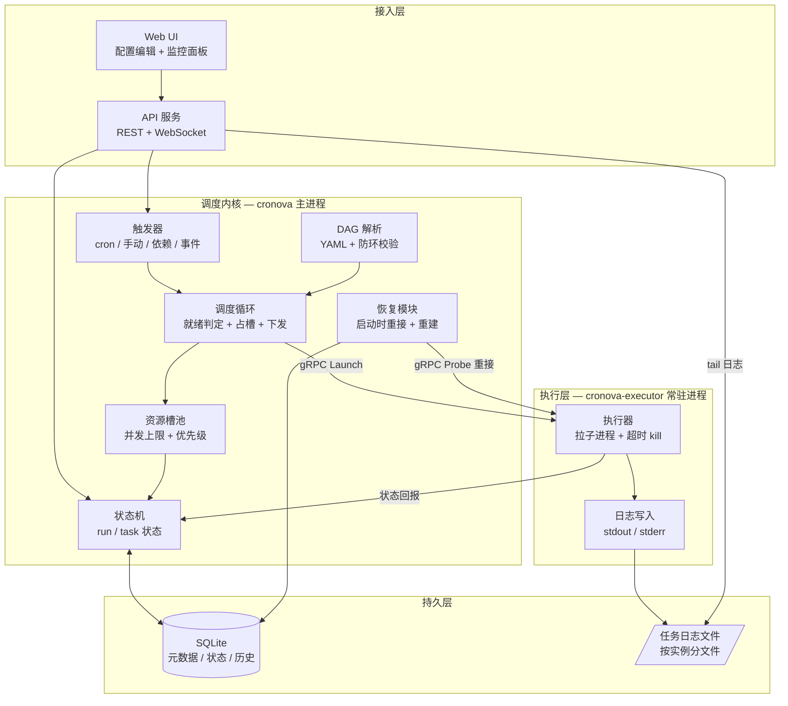
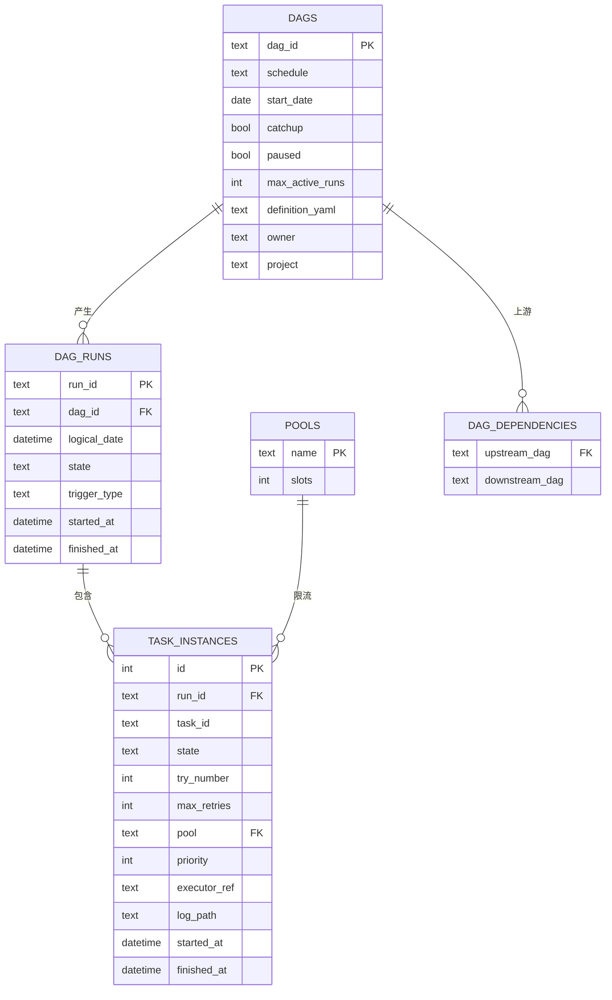
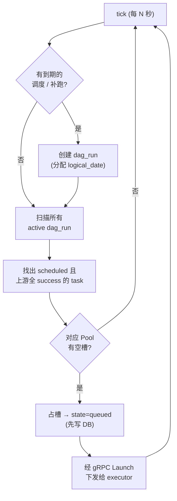
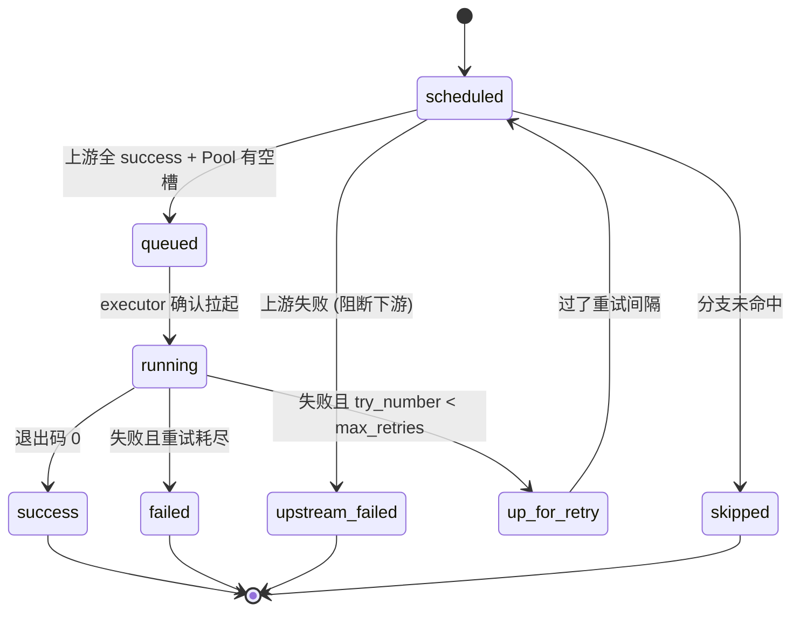
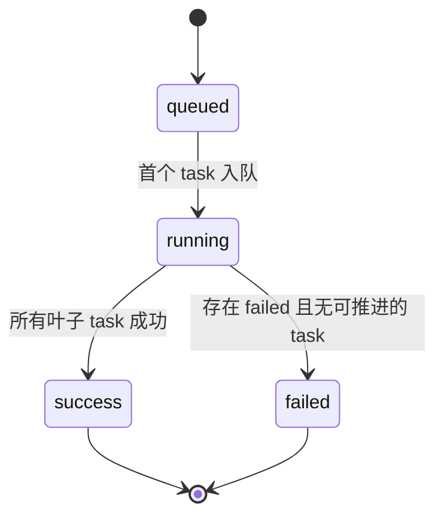
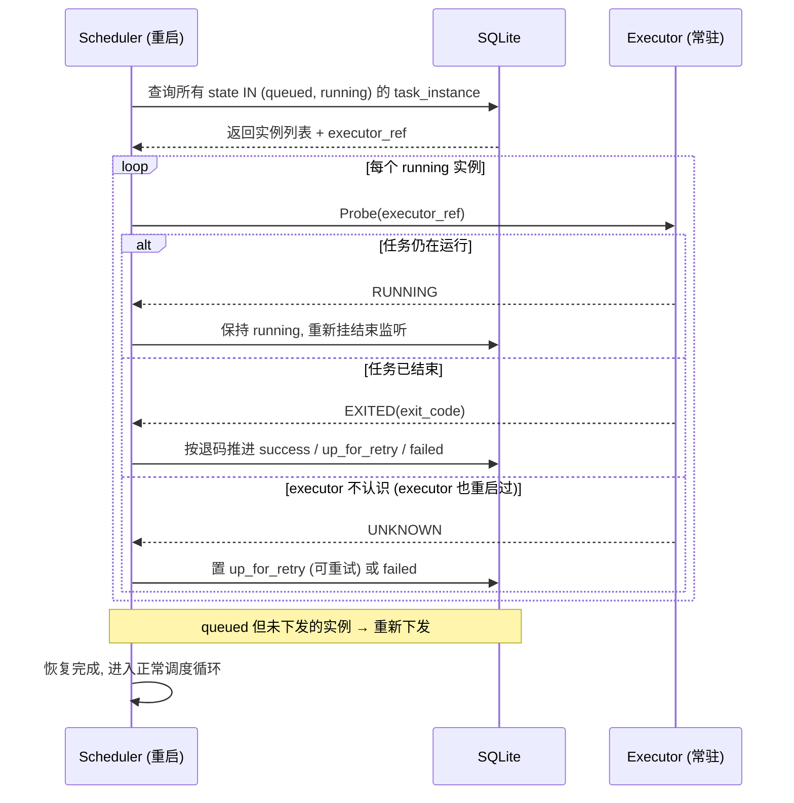
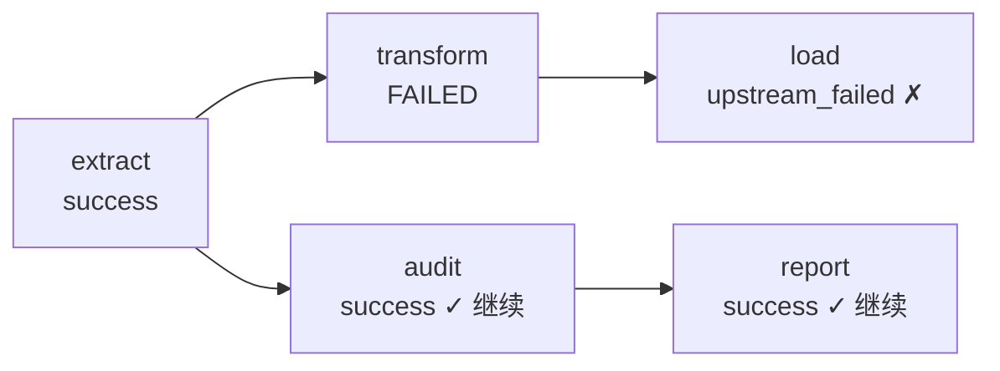
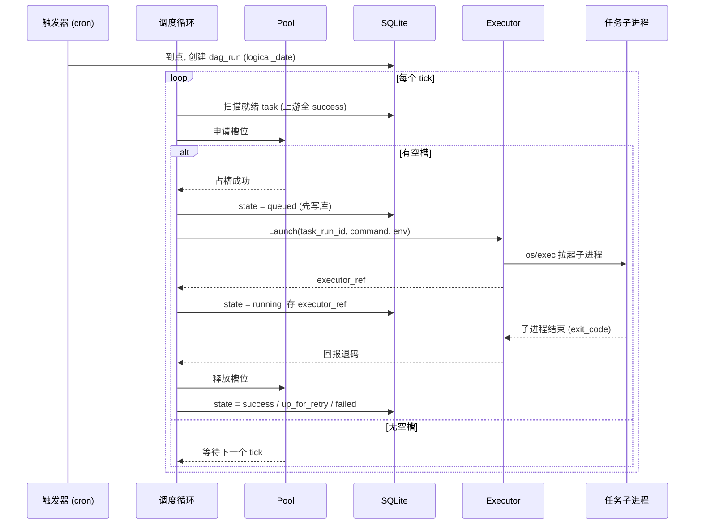
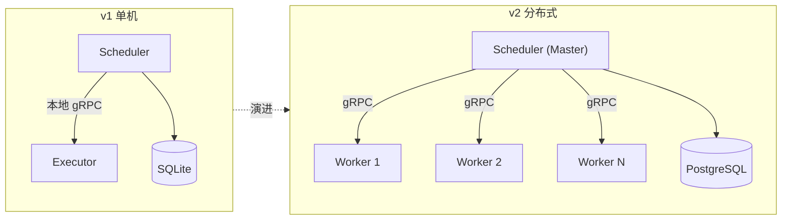

# cronova 架构设计文档

> 一个类 Airflow / Azkaban 的工作流调度框架。
> 版本：v1（单机起步，预留分布式演进）
> 最后更新：2026-06-24

---

## 目录

1. [项目定位](#1-项目定位)
2. [架构决策记录（ADR）](#2-架构决策记录adr)
3. [总体架构](#3-总体架构)
4. [模块结构](#4-模块结构)
5. [核心概念](#5-核心概念)
6. [数据模型](#6-数据模型)
7. [调度内核](#7-调度内核)
8. [执行层](#8-执行层)
9. [崩溃恢复机制](#9-崩溃恢复机制)
10. [补跑与逻辑时间（catchup）](#10-补跑与逻辑时间catchup)
11. [资源槽池与并发控制](#11-资源槽池与并发控制)
12. [失败传播与重试](#12-失败传播与重试)
13. [触发流程时序](#13-触发流程时序)
14. [YAML DAG 规范](#14-yaml-dag-规范)
15. [executor gRPC 协议](#15-executor-grpc-协议)
16. [API 与 Web UI](#16-api-与-web-ui)
17. [权限模型](#17-权限模型)
18. [实施路线（M0–M6）](#18-实施路线m0m6)
19. [演进路径：单机 → 分布式](#19-演进路径单机--分布式)
20. [风险与开放问题](#20-风险与开放问题)

---

## 1. 项目定位

cronova 是一个**工作流调度框架**，目标是做成**可用产品**（而非纯学习 demo）。它负责：

- 按 **DAG（有向无环图）** 描述任务之间的依赖关系；
- 按多种方式**触发**工作流（定时 / 手动 / 上游依赖 / 外部事件）；
- 把每个任务作为**独立子进程**拉起，因此天然支持**多语言任务**（Python、SQL、Java、Go、Node 等）；
- 跟踪每次运行（run）和每个任务实例（task instance）的**状态**，提供监控、日志、补跑、重试等运维能力。

**一句话定位**：框架用 Go 写，但调度的任务可以是任何语言——因为任务是被当作子进程拉起的，框架语言与任务语言彻底解耦。

---

## 2. 架构决策记录（ADR）

| # | 决策项 | 选择 | 理由 |
|---|---|---|---|
| 1 | 实现语言 | **Go** | 并发模型（goroutine/channel）天然契合调度器；单二进制部署；`os/exec` 管子进程顺手；gRPC 生态利于后续分布式 |
| 2 | DAG 定义 | 声明式 **YAML** 为底 + **Web UI** 编辑器在上 | 底层可校验、可版本化；上层对非技术用户友好 |
| 3 | 部署形态 | **单机起步**，预留 Master-Worker | 先把内核跑通，再水平扩展 |
| 4 | 任务执行 | **拉子进程**，多语言任务 | 框架/任务语言解耦 |
| 5 | 项目目标 | **做成可用产品** | 偏向健壮、可运维 |
| 6 | 触发方式 | 定时 + 手动 + 依赖 + 事件 | 覆盖调度器核心职责 |
| 7 | 元数据存储 | **嵌入式 SQLite**，store 接口抽象 | 单机零运维；接口隔离便于换 PG/MySQL |
| 8 | 崩溃恢复 | **重接 + 状态重建** | 调度器重启不丢正在跑的任务 |
| 9 | 补跑策略 | **可配置 catchup**（Airflow 风格） | 引入 logical_date，错过的周期可逐个补 |
| 10 | 日志 | **每实例一文件** + UI tail | 单机最实用，避免撑爆 DB |
| 11 | 并发控制 | **资源槽池 Pool** | 限流 + 优先级，防任务洪水 |
| 12 | 执行解耦 | **独立常驻 executor 进程**，本地 gRPC 下发 | 调度器重启不杀任务；executor 即未来 worker 雏形 |
| 13 | 失败传播 | 默认**阻断下游分支**（`upstream_failed`） | 无关并行分支继续；`trigger_rule` 留作扩展 |
| 14 | 逻辑时间 | **注入任务**（env / `{{ logical_date }}`） | 任务按逻辑周期处理数据，补跑才有意义 |
| 15 | 权限 | v1 **先单用户**，预留 `owner`/`project` 字段 | 先把内核做扎实，后续加 RBAC |

---

## 3. 总体架构

四层结构：**接入层 → 调度内核 → 执行层 → 持久层**。调度内核（`cronova` 主进程）与执行器（`cronova-executor` 常驻进程）通过本地 gRPC 通信——这是「重启不丢任务」的关键解耦。



**关键边说明**

- `STATE <--> DB`：**所有状态变更先写库后执行**，SQLite 是唯一真相源。
- `LOOP -- gRPC Launch --> EXEC`：调度器只下发，不直接 fork 子进程；任务的真正父进程是常驻 executor。
- `REC -- gRPC Probe --> EXEC`：调度器重启后，对每个 `running` 实例向 executor 探测，据此重建状态。

---

## 4. 模块结构

Go 项目布局（约定式分层，`internal/` 隔离实现细节）：

```
cronova/
├── cmd/
│   ├── cronova/              # 主进程入口: scheduler + api + web (单机一体)
│   └── cronova-executor/     # 常驻执行器进程入口 (gRPC server)
├── internal/
│   ├── scheduler/
│   │   ├── trigger/          # cron / manual / dependency / event 四类触发源
│   │   ├── parser/           # YAML 解析 + DAG 防环校验 (拓扑排序)
│   │   ├── loop.go           # 调度循环: tick → 扫就绪 → 占槽 → 下发
│   │   └── state/            # run / task 状态机与迁移规则
│   ├── executor/             # 拉子进程 · 超时 kill · stdout/err → 日志文件
│   ├── pool/                 # 资源槽池: 并发上限 + 优先级队列
│   ├── store/                # 持久层 interface + sqlite/ 具体实现 (可换 PG/MySQL)
│   │   ├── store.go          # Store interface
│   │   └── sqlite/           # SQLite 实现 + 迁移脚本
│   ├── model/                # DAG / DagRun / TaskInstance / Pool 领域模型
│   ├── api/                  # REST + WebSocket handlers (日志 tail)
│   └── recovery/             # 启动恢复: 扫 running 实例 → 重接 executor → 重建状态
├── proto/                    # scheduler ↔ executor 的 gRPC .proto 定义
├── web/                      # 前端: 监控面板 + YAML 编辑器
├── dags/                     # 用户的 YAML DAG 定义目录 (可配置路径)
└── docs/
    └── ARCHITECTURE.md       # 本文件
```

**设计要点**

- `store` 是接口，`sqlite` 是其唯一实现 → 未来加 `postgres` 实现即可切换，调度逻辑零改动。
- `scheduler` 与 `executor` 各有独立 `cmd/` 入口；单机模式下由主进程顺带拉起 executor，分布式时 executor 单独部署。

---

## 5. 核心概念

| 概念 | 说明 |
|---|---|
| **DAG** | 一个工作流定义：一组 task + 它们之间的依赖边，必须无环 |
| **Task** | DAG 中的一个节点，定义「跑什么命令、依赖谁、重试几次、用哪个 pool」 |
| **DAG Run** | DAG 的一次具体运行实例，由某次触发产生，带一个 `logical_date` |
| **Task Instance** | 某个 DAG Run 中某个 Task 的具体执行，是状态机的最小单元 |
| **logical_date** | 逻辑时间：这次 run **代表的业务周期**，而非墙上时间。补跑的命根子 |
| **Pool** | 资源槽池：一组并发槽位，限制同时运行的任务数 |
| **trigger** | 触发源：定时 / 手动 / 上游依赖 / 外部事件 |
| **executor_ref** | executor 为每个已拉起任务返回的句柄，崩溃恢复时用它重接 |

### 逻辑时间（logical_date）为什么重要？

假设一个「每天处理昨天数据」的 ETL，配置 `schedule: 0 2 * * *`。

- 6/10 凌晨 2 点触发的 run，它的 `logical_date = 6/9`，任务应处理 **6/9 的数据**。
- 如果调度器 6/8–6/10 宕机了 3 天，开启 catchup 后重启，应**补出 6/8、6/9、6/10 三个独立 run**，各自带不同 logical_date，分别处理对应天的数据。

如果任务只知道「现在几点」而不知道 logical_date，补跑就毫无意义——所有补跑都会处理「今天」的数据。所以 logical_date 必须**注入给任务**（见 [§10](#10-补跑与逻辑时间catchup)）。

---

## 6. 数据模型

SQLite 关系模型。核心五张表 + 两张扩展表。



### DDL 草案

```sql
-- DAG 定义元数据
CREATE TABLE dags (
    dag_id          TEXT PRIMARY KEY,
    schedule        TEXT,                 -- cron 表达式; NULL = 仅手动/事件触发
    start_date      DATE,
    catchup         INTEGER NOT NULL DEFAULT 0,
    paused          INTEGER NOT NULL DEFAULT 0,
    max_active_runs INTEGER NOT NULL DEFAULT 1,
    definition_yaml TEXT NOT NULL,        -- 原始 YAML, 便于 UI 回显/版本化
    owner           TEXT,                 -- v1 预留
    project         TEXT,                 -- v1 预留
    created_at      DATETIME DEFAULT CURRENT_TIMESTAMP,
    updated_at      DATETIME DEFAULT CURRENT_TIMESTAMP
);

-- DAG 的一次运行
CREATE TABLE dag_runs (
    run_id        TEXT PRIMARY KEY,       -- 例如 {dag_id}__{logical_date}
    dag_id        TEXT NOT NULL REFERENCES dags(dag_id),
    logical_date  DATETIME NOT NULL,
    state         TEXT NOT NULL,          -- queued/running/success/failed
    trigger_type  TEXT NOT NULL,          -- schedule/manual/dependency/event
    started_at    DATETIME,
    finished_at   DATETIME,
    UNIQUE (dag_id, logical_date)         -- ★ 补跑去重的命根子
);

-- 任务实例 (状态机最小单元)
CREATE TABLE task_instances (
    id            INTEGER PRIMARY KEY AUTOINCREMENT,
    run_id        TEXT NOT NULL REFERENCES dag_runs(run_id),
    task_id       TEXT NOT NULL,
    state         TEXT NOT NULL,          -- 见 §7 状态机
    try_number    INTEGER NOT NULL DEFAULT 0,
    max_retries   INTEGER NOT NULL DEFAULT 0,
    pool          TEXT NOT NULL DEFAULT 'default' REFERENCES pools(name),
    priority      INTEGER NOT NULL DEFAULT 0,
    executor_ref  TEXT,                   -- executor 返回的句柄, 重接用
    log_path      TEXT,
    started_at    DATETIME,
    finished_at   DATETIME,
    UNIQUE (run_id, task_id)
);

-- 资源槽池
CREATE TABLE pools (
    name   TEXT PRIMARY KEY,
    slots  INTEGER NOT NULL
);
INSERT INTO pools(name, slots) VALUES ('default', 16);

-- 跨 DAG 依赖 (依赖触发)
CREATE TABLE dag_dependencies (
    upstream_dag    TEXT NOT NULL REFERENCES dags(dag_id),
    downstream_dag  TEXT NOT NULL REFERENCES dags(dag_id),
    PRIMARY KEY (upstream_dag, downstream_dag)
);

-- 外部事件 (事件触发)
CREATE TABLE events (
    id          INTEGER PRIMARY KEY AUTOINCREMENT,
    source      TEXT NOT NULL,            -- webhook/file/mq
    event_key   TEXT NOT NULL,
    payload     TEXT,
    consumed    INTEGER NOT NULL DEFAULT 0,
    created_at  DATETIME DEFAULT CURRENT_TIMESTAMP
);

CREATE INDEX idx_ti_state   ON task_instances(state);
CREATE INDEX idx_ti_run     ON task_instances(run_id);
CREATE INDEX idx_runs_state ON dag_runs(state);
```

> **并发与日志模式**：实现用纯 Go 的 `modernc.org/sqlite`（零 CGO）。它的 WAL 共享内存是进程内模拟的，**不跨 OS 进程协调**，而 cronova 的 CLI（`trigger`/`runs`）会与运行中的 `serve` 进程并发访问同一 DB——因此用 **回滚日志 DELETE 模式**（`PRAGMA journal_mode=DELETE`，真实文件锁，跨进程安全）而非 WAL，并设 `busy_timeout` 让锁竞争重试。store 层用 `MaxOpenConns(1)` 把进程内访问串行化；这也意味着 WAL 的「并发读」优势在此用不上，DELETE 不损失什么。后续若 Web UI 读并发成为瓶颈，再评估提高连接数 + 切回 WAL（需先验证 modernc 跨进程 WAL，或改用单进程内嵌 API）。

---

## 7. 调度内核

### 7.1 触发器（4 类触发源）

所有触发源最终都做同一件事：**创建一个 `dag_run`（带 logical_date）**，剩下交给调度循环。

| 触发源 | 机制 | logical_date 来源 |
|---|---|---|
| **定时 cron** | 内部时钟按 cron 表达式计算下一个触发点 | = 该调度周期的边界 |
| **手动** | UI / API 立即创建一个 run | = 当前时间（或用户指定） |
| **依赖/上游** | 监听 `dag_dependencies`，上游 run 成功后触发下游 | = 上游 run 的 logical_date |
| **事件/外部** | webhook / file sensor 写入 `events` 表，触发器消费 | = 事件时间或当前时间 |

### 7.2 DAG 解析与校验

1. 读取 `dags/` 下的 YAML（或 UI 提交的内容）；
2. 解析成内存中的 task 列表 + 依赖边；
3. **拓扑排序检测环**——有环则拒绝加载并报错；
4. 校验：task id 唯一、deps 引用存在、pool 存在、cron 合法。

### 7.3 调度循环

调度循环是内核的心脏，按固定 tick（如每 5 秒）运行：



**关键不变量**：`state=queued` 必须在 gRPC 下发**之前**写入 DB。这样即使下发瞬间调度器崩溃，重启后也能从 DB 看到这个 queued 实例并妥善处理。

### 7.4 Task 状态机

任务实例的状态与迁移：



> 实现说明：状态机实现（`internal/model/state.go`）额外允许两条边：`queued → upstream_failed`（排队等待时上游先行失败）与 `queued → failed`（executor 的 Launch RPC 失败，任务从未运行）。

### 7.5 DAG Run 状态机



> 实现说明：实现额外允许防御性边 `queued → success` 与 `queued → failed`——run 可能在任何 task 进入 running 前就解决（如所有 task 被 skip，或排队期间被中止）。正常路径仍是 `queued → running → *`。

---

## 8. 执行层

执行层是一个**独立常驻进程** `cronova-executor`，通过本地 gRPC 接受调度器下发。

### 职责

1. **Launch**：收到任务后，用 `os/exec` 在独立进程组中拉起子进程；
2. **超时控制**：到 `timeout` 未结束则 `kill` 整个进程组；
3. **日志**：把子进程的 stdout/stderr 重定向到 `log_path` 指定的文件（每任务实例一个文件）；
4. **状态回报**：子进程结束后，把退出码回报给调度器（推或拉）；
5. **Probe**：应答调度器的重接探测（任务还在不在、退码多少）。

### 为什么必须是独立进程？

如果调度器直接 fork 子进程当亲儿子，调度器一重启，子进程要么被杀、要么变孤儿，无法「重接」。把执行权交给常驻 executor 后：

- 调度器重启 → executor 和它管的子进程**毫发无损**，重启后重新连上即可；
- 这个 executor 进程**就是未来分布式架构里 worker 的雏形**，前向兼容。

### 多语言任务

因为任务是子进程，`type` 字段决定怎么拼命令：

| type | 拉起方式 |
|---|---|
| `shell` | `sh -c "<command>"` |
| `python` | `python <script> <args>` |
| `sql` | 通过对应 CLI/驱动（如 `psql -f`） |
| `jar` | `java -jar <jar> <args>` |
| `bash`/任意 | 任何可执行命令 |

逻辑时间等上下文通过**环境变量**注入（`CRONOVA_LOGICAL_DATE`、`CRONOVA_RUN_ID` 等）。

---

## 9. 崩溃恢复机制

「重接 + 状态重建」是「可用产品」的试金石。调度器重启后的恢复流程：



**幂等保障**：`task_run_id`（= run_id + task_id）作为下发的幂等键。即使重接时重复下发，executor 也能识别「这个任务我已经在跑了」而不重复拉起。

---

## 10. 补跑与逻辑时间（catchup）

### catchup 的计算

DAG 配置 `start_date` 和 `catchup: true` 时，调度器按如下方式补齐：

```
最后一个已有 run 的 logical_date  →  现在
按 schedule 步进, 每个错过的周期边界 = 一个待补 run
对每个待补 logical_date:
    若 dag_runs 中 (dag_id, logical_date) 不存在 → 创建
    (UNIQUE 约束保证不会重复创建)
```

例：`schedule: 0 2 * * *`，`start_date: 6/8`，调度器 6/8–6/10 宕机，6/11 重启：


若 `catchup: false`，则只创建 6/11 这一个 run，6/8–6/10 直接跳过。

### 逻辑时间注入

每个任务子进程启动时注入环境变量：

```bash
CRONOVA_LOGICAL_DATE=2026-06-09
CRONOVA_RUN_ID=daily_etl__2026-06-09
CRONOVA_TASK_ID=extract
CRONOVA_TRY_NUMBER=1
```

YAML 中也支持模板占位符 `{{ logical_date }}`，解析时替换：

```yaml
command: "python extract.py --date {{ logical_date }}"
# 6/9 这个 run 实际执行: python extract.py --date 2026-06-09
```

> **前提：任务必须幂等**。同一个 logical_date 重跑应产生相同结果，否则补跑/重试会污染数据。

---

## 11. 资源槽池与并发控制

防止任务洪水压垮单机。

- 每个 **Pool** 是一组并发槽位（`slots`），是**全局资源**（跨所有 DAG/run 共享计数）；
- task 在 YAML 里声明用哪个 pool（默认 `default`，16 槽）；DAG 引用但未配置的 pool 会以默认槽数自动创建；
- pool 槽数用 CLI 配置（pool 是全局资源，不在 DAG YAML 里）：`cronova pools set <name> <slots>`，`cronova pools` 查看；
- 调度循环把 task 置为 `queued` 前，必须**占到一个槽**（按 `state IN (queued,running)` 全局计数）；任务进入终态时释放槽；
- 多个就绪任务竞争槽时，按 `priority` 降序派发，满了的 pool 推迟到下个 tick。

```
default pool (slots=16):  [■■■■■■■■□□□□□□□□]  当前 8 个在跑, 还能再上 8 个
heavy   pool (slots=2):   [■■]                Spark 类重任务专用, 最多并行 2 个
```

这样可以给「重任务」单独开小池子，避免它们挤占轻任务的资源。

---

## 12. 失败传播与重试

### 重试

task 失败且 `try_number < max_retries` → 进入 `up_for_retry`，过 `retry_delay` 后回到 `scheduled` 重新调度。

### 失败传播（默认策略：阻断下游分支）

某 task 最终 `failed` 时，**只阻断它的下游**，无关的并行分支继续：



`transform` 失败 → 只有 `load` 被标 `upstream_failed`；`audit`/`report` 这条无关分支照常完成。

> **扩展点**：未来可在依赖边/任务上配置 `trigger_rule`（`all_success` / `all_done` / `one_failed` 等），实现「无论上游成败都跑」的清理任务等高级语义。v1 先固定为「上游全 success 才跑」。

---

## 13. 触发流程时序

一次完整的「定时触发 → 执行 → 完成」时序：



---

## 14. YAML DAG 规范

```yaml
# 一个 DAG = 一个 YAML 文件
dag_id: daily_etl              # 全局唯一
schedule: "0 2 * * *"          # cron; 留空则仅手动/事件触发
start_date: 2026-06-01
catchup: true                  # 是否补跑错过的周期
max_active_runs: 1             # 同一 DAG 最多并发几个 run
default_retries: 2             # task 默认重试次数
default_retry_delay: 300       # 默认重试间隔(秒)

tasks:
  - id: extract
    type: shell                # shell/python/sql/jar ...
    command: "python extract.py --date {{ logical_date }}"
    pool: default              # 用哪个资源池
    priority: 10               # 同池竞争时的优先级

  - id: transform
    type: shell
    command: "python transform.py --date {{ logical_date }}"
    deps: [extract]            # 依赖 extract 成功

  - id: load
    type: shell
    command: "psql -f load.sql"
    deps: [transform]
    retries: 3                 # 覆盖默认重试
    timeout: 1800              # 超时(秒), 超时则 kill

# 跨 DAG 依赖 (可选, 也可在独立配置里声明)
trigger_after:
  - dag_id: upstream_ingest    # upstream_ingest 成功后触发本 DAG
```

**可用模板变量**：`{{ logical_date }}`、`{{ run_id }}`、`{{ task_id }}`、`{{ try_number }}`。

---

## 15. executor gRPC 协议

调度器与执行器之间的契约（草案）：

```protobuf
syntax = "proto3";
package cronova.executor.v1;

service Executor {
  rpc Launch (LaunchRequest)  returns (LaunchResponse);   // 下发任务
  rpc Probe  (ProbeRequest)   returns (ProbeResponse);    // 重接探测
  rpc Cancel (CancelRequest)  returns (CancelResponse);   // 取消 / 超时 kill
  rpc StreamLogs (LogRequest) returns (stream LogChunk);  // 实时日志 (可选, M5)
}

message LaunchRequest {
  string task_run_id          = 1;  // = run_id + task_id, 幂等键
  string type                 = 2;  // shell / python / sql / jar
  string command              = 3;
  map<string, string> env     = 4;  // 含 CRONOVA_LOGICAL_DATE 等
  int32  timeout_sec          = 5;
  string log_path             = 6;
}
message LaunchResponse { string executor_ref = 1; }  // 重接用句柄

message ProbeRequest  { string executor_ref = 1; }
enum TaskPhase { RUNNING = 0; EXITED = 1; UNKNOWN = 2; }
message ProbeResponse {
  TaskPhase phase     = 1;
  int32     exit_code = 2;          // phase=EXITED 时有效
}

message CancelRequest  { string executor_ref = 1; }
message CancelResponse { bool   ok           = 1; }

message LogRequest { string executor_ref = 1; int64 from_offset = 2; }
message LogChunk   { bytes  data         = 1; int64 offset      = 2; }
```

**幂等约定**：`Launch` 用 `task_run_id` 去重——重接误下发时，executor 若发现该任务已在跑，直接返回已有 `executor_ref`，不重复拉起。

---

## 16. API 与 Web UI

### REST API（节选）

| 方法 | 路径 | 说明 |
|---|---|---|
| `GET` | `/api/dags` | 列出所有 DAG |
| `POST` | `/api/dags` | 提交/更新 DAG（YAML） |
| `POST` | `/api/dags/{id}/pause` | 暂停/恢复调度 |
| `POST` | `/api/dags/{id}/trigger` | 手动触发一次 run |
| `GET` | `/api/dags/{id}/runs` | 查看运行历史 |
| `GET` | `/api/runs/{run_id}` | 查看某次 run 的 task 状态 |
| `POST` | `/api/runs/{run_id}/tasks/{task_id}/clear` | 清除并重跑某 task |
| `GET` | `/api/tasks/{ti_id}/log` | 拉取任务日志（支持 tail） |
| `WS` | `/api/tasks/{ti_id}/log/stream` | 实时日志流 |
| `POST` | `/api/events` | 外部事件入口（事件触发） |

### Web UI 模块

- **DAG 列表**：开关、最近运行状态、下次调度时间；
- **DAG 详情 / 图视图**：可视化依赖图 + 每个 task 的状态着色；
- **运行历史**：按 logical_date 列出 run，支持手动触发/补跑；
- **任务日志**：点开 task 实时 tail 日志；
- **YAML 编辑器**：在线编辑 + 校验（防环、字段合法性）。

---

## 17. 权限模型

v1 **先单用户**，但数据模型预留扩展位：

- `dags` 表已有 `owner` / `project` 字段；
- API 层预留鉴权中间件挂载点；
- 演进顺序：单用户 → 基础登录 + API token → 项目隔离 → 完整 RBAC（用户/角色/权限）。

---

## 18. 实施路线（M0–M6）

增量交付，每个里程碑都可独立验证。**先把内核做扎实（M1–M2），再加花活。**

| 里程碑 | 内容 | 验收标准 |
|---|---|---|
| **M0** | 项目骨架 + SQLite schema + store 接口 + 领域模型 | 编译通过；能建表；store CRUD 单测过 |
| **M1** | 调度内核 MVP：YAML 解析+防环 → 调度循环 → 状态机 → **内嵌执行**(先不解耦) + 文件日志（定时 + 手动触发） | 能跑通一个线性 DAG，状态正确流转 |
| **M2** | **executor 解耦**（gRPC）+ **崩溃恢复重接** | 任务运行中杀掉调度器并重启，任务不丢、状态正确恢复 |
| **M3** | 依赖触发 + Pool 并发 + 重试/超时 | 多 DAG 协同；pool 限流生效；失败按策略传播 |
| **M4** | catchup 补跑 + logical_date 注入 | 宕机后重启能补出正确数量的历史 run，任务收到正确 logical_date |
| **M5** | Web UI：监控面板 + 日志 tail + 手动触发 + YAML 编辑 | 浏览器里可视化操作全链路 |
| **M6** | 事件触发（webhook / file sensor） | 外部信号能驱动 DAG 运行 |

> **M2 是关键里程碑**：「杀进程重启不丢任务」是「可用产品」与「玩具」的分水岭，建议优先打磨。

---

## 19. 演进路径：单机 → 分布式

当前架构的解耦设计已为分布式铺路：



迁移要点：

1. **executor → worker**：本地 executor 直接变成可远程部署的 worker，gRPC 协议不变；
2. **SQLite → PostgreSQL**：换 `store` 的实现即可，调度逻辑零改动；
3. **调度器选主**：多调度器时需引入选主（如基于 DB 行锁或 etcd/raft）避免重复调度；
4. **任务分发策略**：master 按 worker 负载/标签把任务路由到合适的 worker。

---

## 20. 风险与开放问题

| 风险 / 问题 | 说明 | 缓解 / 待决 |
|---|---|---|
| SQLite 写并发 | 调度循环 + API/CLI 并发写易 `SQLITE_BUSY` | DELETE 回滚日志(跨进程文件锁) + `MaxOpenConns(1)` 串行化 + `busy_timeout`；写多了再换 PG |
| 日志文件膨胀 | 每实例一文件，长期积累占满磁盘 | 加日志保留期 + 定期清理/归档 |
| 任务非幂等 | 补跑/重试会污染数据 | 文档强约束；提供 logical_date 鼓励幂等设计 |
| executor 单点 | 单机只有一个 executor | v1 可接受；分布式版多 worker 解决 |
| 时区 / DST | cron 与 logical_date 的时区处理 | 统一用 UTC 存储，展示层转本地 |
| 长时间宕机后 catchup 风暴 | 补跑几百个 run 瞬间压垮系统 | `max_active_runs` 限流 + 可配置补跑上限 |
| `trigger_rule` 缺失 | v1 只支持「上游全成功」 | 列为 M3 之后的扩展项 |

---

*本文档随设计演进持续更新。实现细节以代码为准。*
