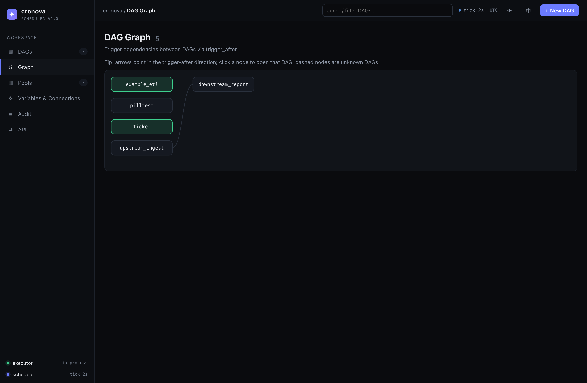
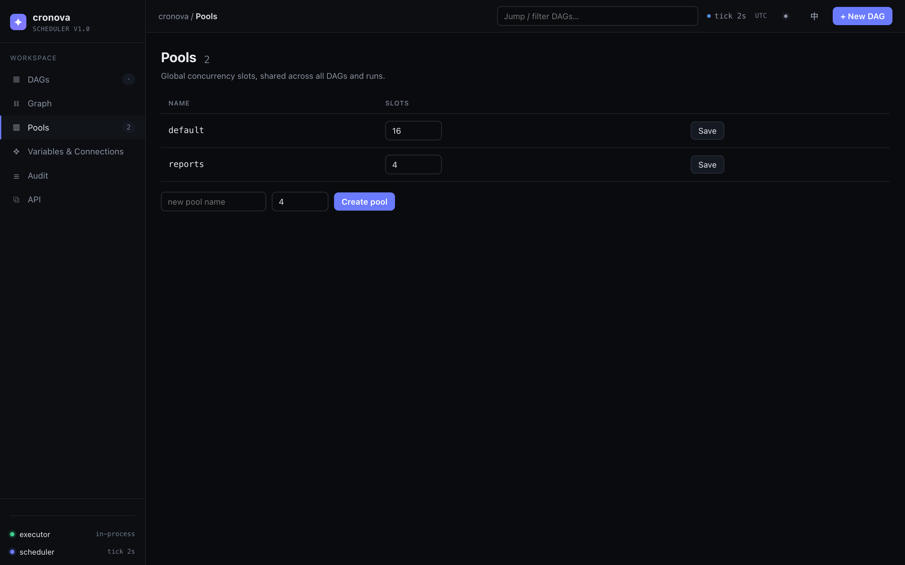
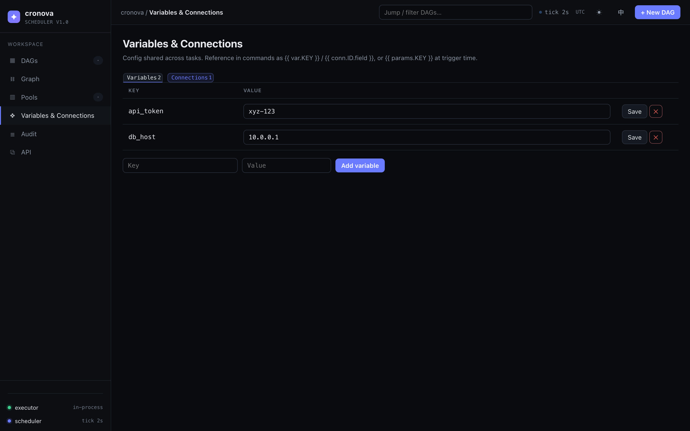
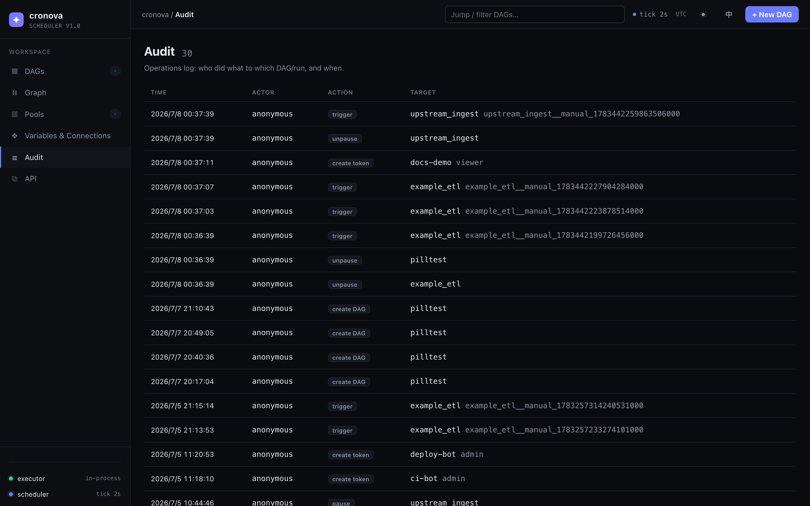
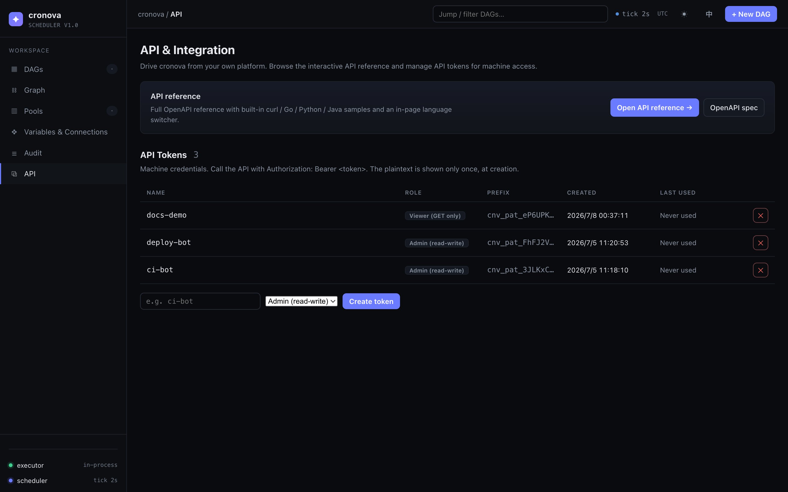

# Graph, pools, variables, workers, audit & API tokens

The operations pages of the cronova web console: the cross-DAG dependency graph, global concurrency pools, shared variables and connections, the dial-in worker fleet, the operator audit trail, and API tokens for machine access. Everything here lives in the sidebar below your DAG list, at `http://localhost:8090`.

## Cross-DAG graph (`#/graph`)

The **Graph** page draws every [`trigger_after`](../tutorial/cross-dag.md) relationship in your installation as one picture — which DAGs fire which other DAGs when they finish.



How to read it:

| Element | Meaning |
|---|---|
| Arrow | Points in the *trigger-after* direction: upstream DAG → the DAG it triggers on completion. |
| Node color | Tinted by that DAG's latest run state (green success, red failed, blue running, …). Neutral means no runs yet. |
| Solid node | A known DAG — **click it to open that DAG's page** ([Working with a DAG](dag.md)). |
| Dashed node | An unknown DAG: something references it in `trigger_after`, but no DAG with that id exists. Dashed nodes are not clickable. |

Navigate large graphs by **dragging to pan** and zooming with ++ctrl++ / ++cmd++ + mouse wheel — a plain wheel still scrolls the page. The overlay buttons in the corner zoom in (`+`), zoom out (`−`), and fit the whole graph to the viewport (`⤢`).

If no DAG declares `trigger_after`, the page shows an empty state instead of a graph.

## Pools (`#/pools`)

**Pools** are named sets of global concurrency slots, shared across all DAGs and runs. A task occupies one slot of its pool while it executes; when a pool is full, further tasks queue until a slot frees up.



The table lists every pool:

| Column | Description |
|---|---|
| Name | Pool id, referenced from task YAML. |
| Slots | Maximum concurrent tasks — an editable number field (minimum 1). |
| Save | Applies the new slot count for that row. |

- **Create a pool**: type a name and a slot count in the toolbar below the table (default 4) and click **Create**.
- **Resize a pool**: change the number in its Slots field and click **Save**.

Tasks opt in with the `pool:` field; every task defaults to the `default` pool, and `priority` decides who wins a contended slot. See [DAG & Task Reference](../DAG_REFERENCE.md#resource-pools) for the YAML side and the [pools tutorial](../tutorial/retries-timeouts-pools.md) for a worked example. You can also manage pools from the CLI with `cronova pools set` ([CLI Reference](../CLI.md)).

## Variables & Connections (`#/resources`)

The **Variables & Connections** page holds configuration shared across tasks, in three tabs: variables, connections, and alert groups. Reference values in task commands as `{{ var.KEY }}` and `{{ conn.ID.field }}`, or pass `{{ params.KEY }}` at trigger time — the [template variables tutorial](../tutorial/variables-connections-params.md) covers the first two.



### Variables

Plain key/value pairs, edited inline:

| Column | Description |
|---|---|
| Key | Variable name. Letters, digits, `_`, `.` and `-` only. |
| Value | Editable text field — change it and click **Save** on the same row. |
| Actions | **Save** the row, or **✕** to delete (with confirmation). |

Add a new variable with the key + value inputs below the table and **Add variable**. Use it anywhere templates render, e.g. `Authorization: Bearer {{ var.TOKEN }}`.

### Connections

Named endpoint credentials — databases, APIs, hosts. The list shows each connection's id, type, host:port, login, and whether a password is set (`••••••`); **Edit** opens the dialog, **✕** deletes.

**New connection** opens a dialog with these fields:

| Field | Notes |
|---|---|
| Connection ID | e.g. `mysql_prod`. Fixed after creation (same charset rule as variable keys). |
| Type | Free text, e.g. `mysql`. |
| Host / Port / Login | Endpoint address and user. |
| Password | **Write-only.** On edit it starts blank; leave it blank to keep the stored secret. |
| Extra (JSON) | Arbitrary extra fields as a JSON object, e.g. `{"schema":"prod"}`. |

!!! warning "Passwords are never displayed back"
    The console (and the API) never return a stored connection password — the list only shows *whether* one is set. To rotate a secret, type a new value; to keep it, leave the field blank.

In templates, read connection fields as `{{ conn.ID.host }}`, `.port`, `.login` (alias `.user`), `.password`, `.type`, or `{{ conn.ID.extra.KEY }}` for Extra-JSON keys. `sql` tasks consume a connection directly via their `conn:` field — see [DAG & Task Reference](../DAG_REFERENCE.md).

### Alert groups

Named fan-outs of notification channels (expert mode). A DAG that sets **Alert group** in its Settings → Notifications row alerts *every* channel of the group instead of its single webhook URL — when the on-call destinations change, edit them here once instead of in every DAG.

The list shows each group's name, channel count with a per-channel destination summary, and last-updated time; **Edit** opens the dialog, **✕** deletes (with confirmation — referencing DAGs fall back to their own notify URL, so no alert is lost).

**New alert group** opens a dialog:

| Field | Notes |
|---|---|
| Group name | e.g. `oncall`. Fixed after creation (same charset rule as variable keys, max 128 chars). |
| Channels | 1–16 rows, each a URL + message format. URLs may be `http(s)://` incoming webhooks or `mailto:addr[,addr]`; formats are `raw`, `slack`, `feishu`, `dingtalk`, or `email`. **+ Add channel** appends a row, **✕** removes one. |

!!! note "mailto: channels need SMTP"
    Email channels are delivered through the server's SMTP relay — configure the `smtp:` section of the server config first, or mail deliveries fail (logged, never blocking runs).

In DAG YAML the group is referenced as `notify.group` — see [DAG & Task Reference](../DAG_REFERENCE.md#notifications-webhooks-email--alert-groups) for the resolution rules (group wins over `notify.url`; a dangling reference falls back rather than dropping the alert).

## Workers (`#/workers`)

The **Workers** page (expert mode) manages the fleet of remote workers dialed into this scheduler. Tasks opt into remote execution with the `worker_group` field (DAG- or task-level, see [DAG & Task Reference](../DAG_REFERENCE.md)); a task's group is matched against each worker's `group` label (default `default`).

The table lists every registered worker and refreshes itself every ~5 seconds while the page is open:

| Column | Description |
|---|---|
| Name | The name the worker joined with (labels beyond `group` show underneath as muted `k=v` text). |
| worker_id | Server-assigned id (click to copy). |
| Group | The worker's routing group — the `group` label, `default` when unset. |
| State | **online** (session up and heartbeating), **offline** (clean disconnect), or **lost** (heartbeats stopped without a goodbye; its running tasks fail over per retry policy). A **draining** tag is appended while draining. |
| Active tasks | Tasks currently executing on the worker. |
| Version | The worker binary's version. |
| Last heartbeat | Relative time of the last heartbeat (hover for the absolute time). |
| Joined | When the worker first joined. |

**Row actions** (admin only):

- **Drain / Undrain** — a draining worker finishes its running tasks but receives no new assignments; use it before maintenance. Undrain resumes assignments. Both ask for confirmation.
- **✕ Remove** — deletes the registration and closes any live session, after a confirmation warning. Removal is immediate and permanent: the worker's certificate stops being accepted, so **a removed worker cannot reconnect** — it must re-join with a fresh token.

### Joining a worker

Attaching a worker takes two steps:

1. Click **New join token** (admin), pick an expiry (1 hour / 24 hours / 7 days), and mint. The one-time token is shown **exactly once** — copy it now; only its hash is stored.
2. On the worker host, run the join command shown next to the token:

```bash
cronova worker -server <console-url> -join-token <token>
```

The worker exchanges the token + a CSR for a signed certificate (its private key never leaves the host) and dials the hub; it appears **online** in the table within seconds. Tokens are single-use and expire on their TTL.

!!! note "Requires `worker_listen`"
    The worker hub is off by default. If minting a token fails with *worker hub is not enabled*, set `worker_listen` in the server config (or the `CRONOVA_WORKER_LISTEN` environment variable) and restart the server.

## Audit (`#/audit`)

The **Audit** page is the operations log: who did what to which DAG or run, and when. It lists the latest 200 entries.



| Column | Description |
|---|---|
| Time | When the action happened. |
| Actor | The signed-in username, or `anonymous` when authentication is off. |
| Action | What was done (see below). |
| Target | The DAG id, run id, or token affected, plus a detail suffix (e.g. `task=success` for a mark). |

Recorded actions: **trigger**, **cancel**, **retry run**, **retry task**, **mark task**, **mark run**, **create DAG**, **delete DAG**, **pause**, **unpause**, **create token**, **revoke token**, **save alert group**, **delete alert group**, and project uploads/deletes.

!!! note "Auto-saved edits are not logged"
    The [task editor](task-editor.md) auto-saves on every debounced keystroke, so routine edits to an existing DAG are deliberately *not* audited — only the creation of a genuinely new DAG is. The trail stays meaningful instead of drowning in save events.

## API (`#/api`)

The **API & Integration** page is where you connect other systems to cronova: interactive API docs plus API tokens for machine access.



### API reference

- **Open API reference →** opens the interactive docs at `/docs` — a self-contained Redoc page with built-in `curl` / Go / Python / Java samples and an in-page language switcher.
- **OpenAPI spec** serves the raw document at `/openapi.json`, ready to feed into codegen or an HTTP client.

Driving cronova from an AI agent instead? cronova ships a built-in MCP server — see [AI Agents (MCP)](../AGENTS.md).

### API tokens

Tokens are machine credentials. Call any endpoint with the header `Authorization: Bearer <token>`.

| Column | Description |
|---|---|
| Name | Free-form label, e.g. `ci-bot`. |
| Role | **Admin (read-write)** or **Viewer (GET only)**. |
| Prefix | The first characters of the token — the list never shows the full value. |
| Created / Last used | Creation time and last authenticated call (`Never used` until then). |

To **create a token**, enter a name, pick a role, and click **Create token**. To **revoke** one, click **✕** on its row and confirm — revocation is immediate. When authentication is enabled, only admin users can create or revoke tokens.

!!! warning "The token value is shown once"
    The plaintext token appears in a dialog immediately after creation — copy it and store it securely. It is never retrievable again; the list shows only the prefix. If you lose it, revoke the token and create a new one.

## Common questions

**Why is a node dashed in the DAG graph?**
A DAG lists it in `trigger_after`, but no DAG with that id exists (deleted or misspelled). Fix the reference in the upstream DAG's settings, or create the missing DAG.

**Where do I set which pool a task uses?**
In the task's YAML (`pool: reports`) via the [task editor](task-editor.md), not on the Pools page — the Pools page only defines the pools and their slot counts.

**Are variables a safe place for secrets?**
Variable values are displayed in plain text in the console. For credentials, prefer a connection's password field, which is write-only and never echoed back.

**Can a viewer token trigger a DAG run?**
No. Viewer tokens are read-only (GET requests only); triggering, retrying, and editing require an admin token.

## Next steps

- Back to the console overview: [Console](index.md) · [Dashboard & creating DAGs](dashboard.md)
- Operate individual runs: [Runs, logs & recovery](runs-logs.md)
- The full YAML surface: [DAG & Task Reference](../DAG_REFERENCE.md)
