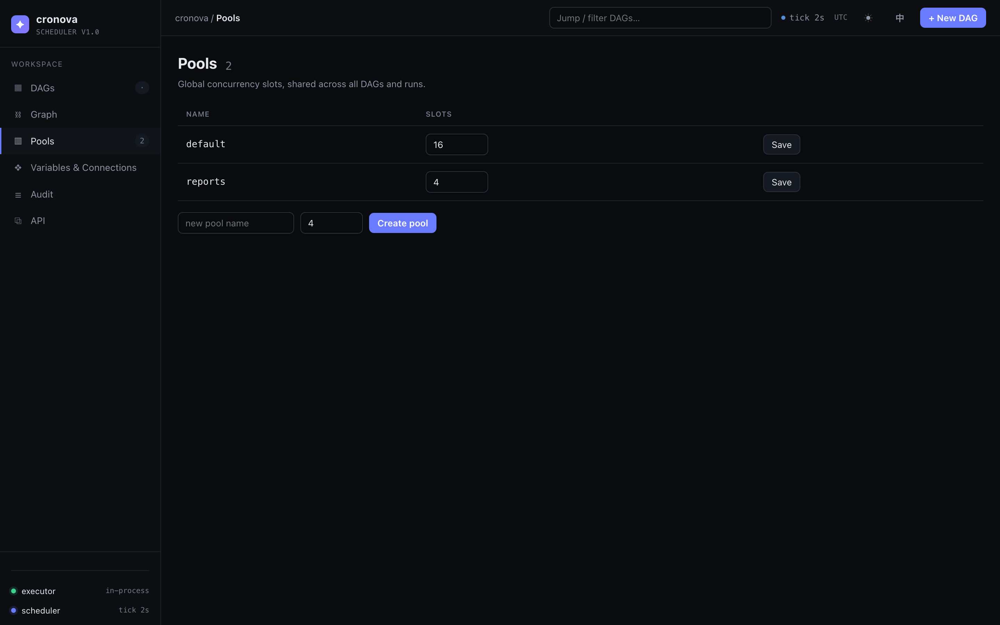
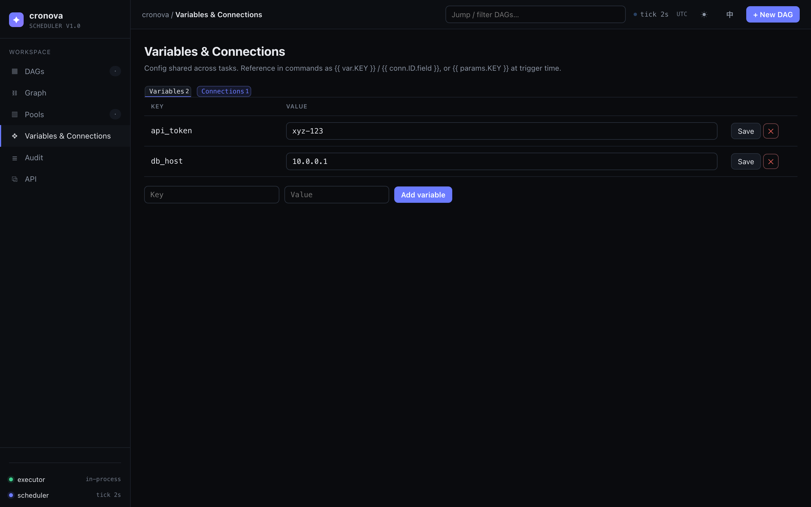
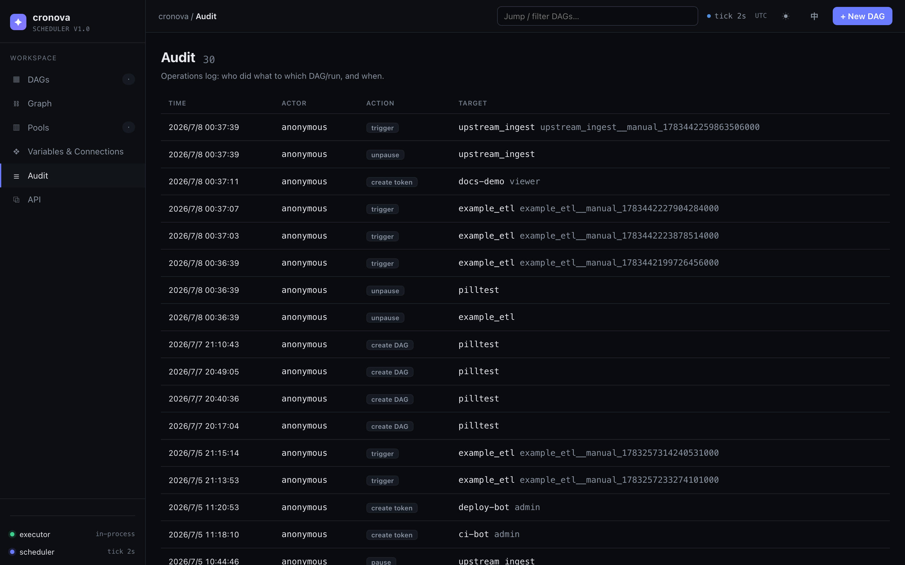
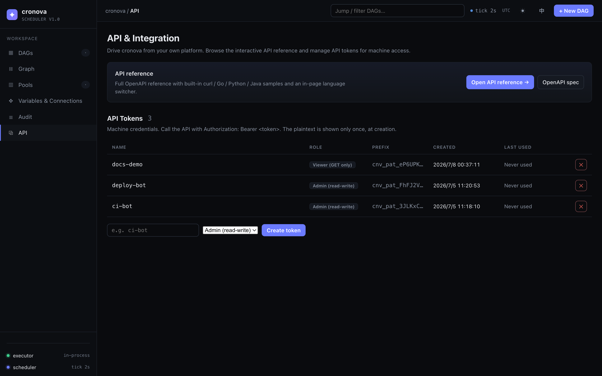

# 依赖图、资源池、变量、审计与 API 令牌

cronova Web 控制台的运维页面：跨 DAG 依赖图、全局并发资源池、共享变量与连接、操作者审计记录，以及供机器访问的 API 令牌。这些页面全部位于 DAG 列表下方的侧边栏中，地址为 `http://localhost:8090`。

## 跨 DAG 依赖图（`#/graph`）

**Graph** 页面把安装中所有 [`trigger_after`](../tutorial/cross-dag.md) 关系绘制成一张图——哪些 DAG 在完成后会触发哪些其他 DAG。

如何解读：

| 元素 | 含义 |
|---|---|
| 箭头 | 指向 *trigger-after* 方向：上游 DAG → 它在完成时触发的 DAG。 |
| 节点颜色 | 按该 DAG 最新一次运行的状态着色（绿色成功、红色失败、蓝色运行中……）。中性色表示尚无运行。 |
| 实线节点 | 已知的 DAG——**点击即可打开该 DAG 的页面**（[使用 DAG](dag.md)）。 |
| 虚线节点 | 未知的 DAG：有 DAG 在 `trigger_after` 中引用了它，但不存在该 id 的 DAG。虚线节点不可点击。 |

浏览大图时可以**拖拽平移**，并用 ++ctrl++ / ++cmd++ + 鼠标滚轮缩放——单独滚动滚轮仍然滚动页面。角落的悬浮按钮分别用于放大（`+`）、缩小（`−`）以及将整个图适配到视口（`⤢`）。

如果没有任何 DAG 声明 `trigger_after`，页面会显示空状态而不是图。

## 资源池（`#/pools`）

**资源池（Pools）**是具名的全局并发槽位集合，在所有 DAG 和运行之间共享。任务执行期间占用其资源池的一个槽位；当资源池被占满时，后续任务会排队等待槽位释放。

表格列出了每个资源池：

| 列 | 说明 |
|---|---|
| Name | 资源池 id，由任务 YAML 引用。 |
| Slots | 最大并发任务数——可编辑的数字输入框（最小值 1）。 |
| Save | 应用该行新的槽位数量。 |

- **创建资源池**：在表格下方的工具栏中输入名称和槽位数量（默认 4），点击 **Create**。
- **调整资源池大小**：修改其 Slots 字段中的数字，点击 **Save**。

任务通过 `pool:` 字段选择加入；每个任务默认属于 `default` 资源池，`priority` 决定谁在槽位竞争中胜出。YAML 侧的说明见 [DAG & Task Reference](../DAG_REFERENCE.md#resource-pools)，完整示例见[资源池教程](../tutorial/retries-timeouts-pools.md)。你也可以通过 CLI 的 `cronova pools set` 管理资源池（[CLI Reference](../CLI.md)）。

## 变量与连接（`#/resources`）

**Variables & Connections** 页面存放跨任务共享的配置，分为两个标签页。在任务命令中以 `{{ var.KEY }}` 和 `{{ conn.ID.field }}` 引用其值，或在触发时传入 `{{ params.KEY }}`——[模板变量教程](../tutorial/variables-connections-params.md)覆盖了这三种用法。

### 变量

普通的键值对，支持内联编辑：

| 列 | 说明 |
|---|---|
| Key | 变量名。仅允许字母、数字、`_`、`.` 和 `-`。 |
| Value | 可编辑的文本框——修改后点击同一行的 **Save**。 |
| Actions | **Save** 保存该行，或点击 **✕** 删除（需确认）。 |

在表格下方的键 + 值输入框中填写并点击 **Add variable** 即可添加新变量。在任何渲染模板的地方都可以使用，例如 `Authorization: Bearer {{ var.TOKEN }}`。

### 连接

具名的端点凭据——数据库、API、主机。列表显示每个连接的 id、类型、host:port、登录名，以及是否设置了密码（`••••••`）；**Edit** 打开编辑对话框，**✕** 删除。

**New connection** 会打开一个包含以下字段的对话框：

| 字段 | 说明 |
|---|---|
| Connection ID | 例如 `mysql_prod`。创建后不可修改（字符集规则与变量键相同）。 |
| Type | 自由文本，例如 `mysql`。 |
| Host / Port / Login | 端点地址与用户。 |
| Password | **只写。**编辑时初始为空；留空则保留已存储的密钥。 |
| Extra (JSON) | 以 JSON 对象形式提供的任意额外字段，例如 `{"schema":"prod"}`。 |

!!! warning "密码永远不会被回显"
    控制台（以及 API）永远不会返回已存储的连接密码——列表只显示*是否*设置了密码。要轮换密钥，输入新值即可；要保留原值，将该字段留空。

在模板中，通过 `{{ conn.ID.host }}`、`.port`、`.login`（别名 `.user`）、`.password`、`.type` 读取连接字段，或用 `{{ conn.ID.extra.KEY }}` 读取 Extra JSON 中的键。`sql` 任务通过其 `conn:` 字段直接使用连接——见 [DAG & Task Reference](../DAG_REFERENCE.md)。

## 审计（`#/audit`）

**Audit** 页面是操作日志：谁在何时对哪个 DAG 或运行做了什么。它列出最近的 200 条记录。

| 列 | 说明 |
|---|---|
| Time | 操作发生的时间。 |
| Actor | 已登录的用户名；未启用认证时为 `anonymous`。 |
| Action | 执行的操作（见下文）。 |
| Target | 受影响的 DAG id、运行 id 或令牌，外加详情后缀（例如标记操作的 `task=success`）。 |

记录的操作包括：**trigger**、**cancel**、**retry run**、**retry task**、**mark task**、**mark run**、**create DAG**、**delete DAG**、**pause**、**unpause**、**create token**、**revoke token**，以及项目上传/删除。

!!! note "自动保存的编辑不会被记录"
    [任务编辑器](task-editor.md)会在每次防抖后的按键时自动保存，因此对已有 DAG 的日常编辑被有意*排除*在审计之外——只有真正新建 DAG 才会被记录。这样审计记录保持有意义，而不会被保存事件淹没。

## API（`#/api`）

**API & Integration** 页面用于将其他系统接入 cronova：交互式 API 文档，加上供机器访问的 API 令牌。

### API 参考

- **Open API reference →** 打开位于 `/docs` 的交互式文档——一个自包含的 Redoc 页面，内置 `curl` / Go / Python / Java 示例和页内语言切换器。
- **OpenAPI spec** 在 `/openapi.json` 提供原始文档，可直接用于代码生成或 HTTP 客户端。

想用 AI 智能体驱动 cronova？cronova 内置了 MCP 服务器——见 [AI Agents (MCP)](../AGENTS.md)。

### API 令牌

令牌是机器凭据。调用任何端点时携带请求头 `Authorization: Bearer <token>`。

| 列 | 说明 |
|---|---|
| Name | 自由格式的标签，例如 `ci-bot`。 |
| Role | **Admin（读写）**或 **Viewer（仅 GET）**。 |
| Prefix | 令牌的前几个字符——列表永远不显示完整值。 |
| Created / Last used | 创建时间和最近一次通过认证的调用（在此之前显示 `Never used`）。 |

要**创建令牌**，输入名称、选择角色，然后点击 **Create token**。要**吊销**令牌，点击其所在行的 **✕** 并确认——吊销立即生效。启用认证后，只有管理员用户可以创建或吊销令牌。

!!! warning "令牌值只显示一次"
    明文令牌会在创建后立即出现在对话框中——请复制并妥善保存。之后再也无法取回；列表只显示前缀。如果丢失，请吊销该令牌并创建新的。

## 常见问题

**为什么依赖图中有的节点是虚线？**
有 DAG 在 `trigger_after` 中列出了它，但不存在该 id 的 DAG（已删除或拼写错误）。请修正上游 DAG 设置中的引用，或创建缺失的 DAG。

**在哪里设置任务使用哪个资源池？**
在任务的 YAML 中（`pool: reports`），通过[任务编辑器](task-editor.md)设置，而不是在 Pools 页面——Pools 页面只定义资源池及其槽位数量。

**变量适合存放密钥吗？**
变量值在控制台中以明文显示。对于凭据，建议使用连接的密码字段，它是只写的，永远不会被回显。

**Viewer 令牌能触发 DAG 运行吗？**
不能。Viewer 令牌是只读的（仅允许 GET 请求）；触发、重试和编辑都需要 Admin 令牌。

## 下一步

- 返回控制台总览：[控制台](index.md) · [仪表盘与创建 DAG](dashboard.md)
- 操作单个运行：[运行、日志与恢复](runs-logs.md)
- 完整的 YAML 说明：[DAG & Task Reference](../DAG_REFERENCE.md)
