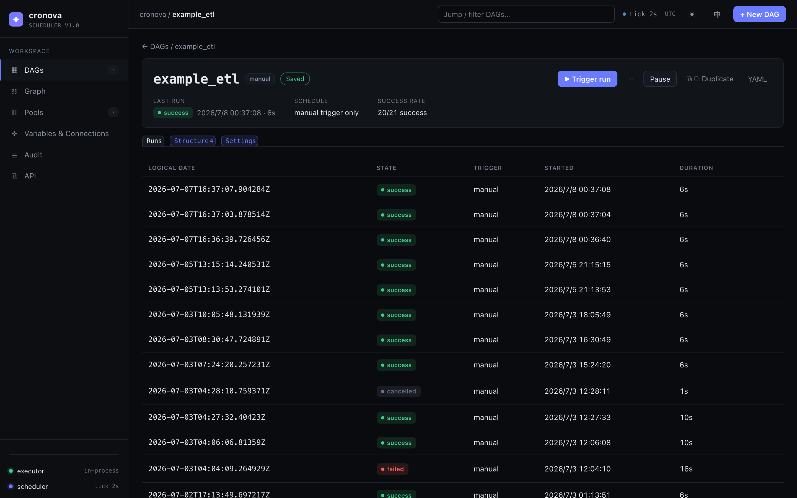
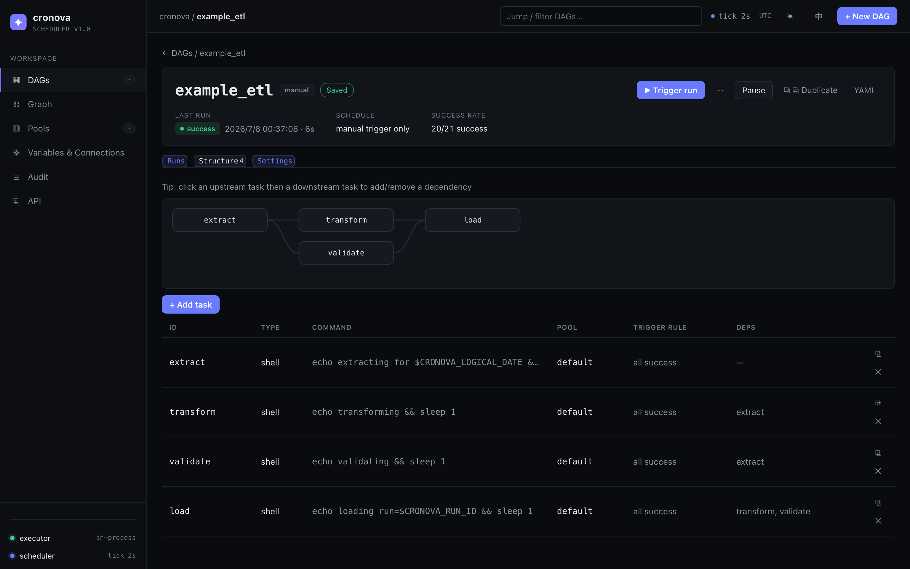
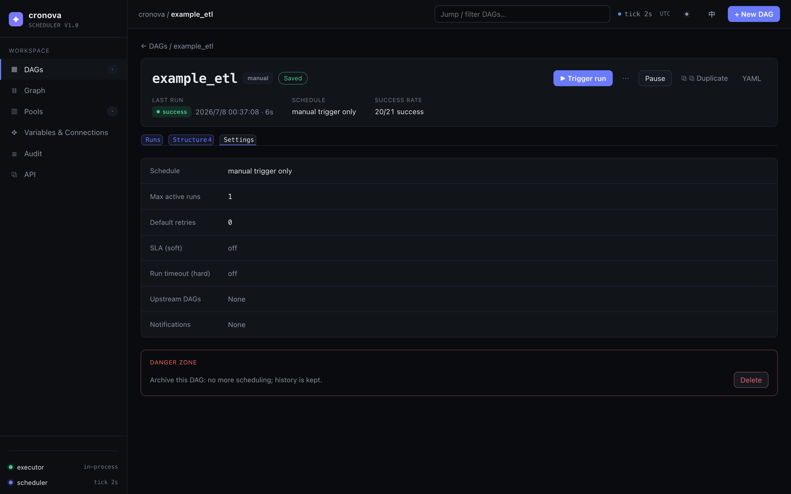

# Working with a DAG

The DAG page (`#/dag/<id>`) is where you operate a single workflow in the cronova web console: trigger and monitor runs, edit tasks and dependencies, and tune scheduling and safety settings. Everything you change here is saved automatically — there is no save button.

Open it by clicking any row on the [dashboard](dashboard.md). The page has a hero header plus three tabs — **Runs**, **Structure**, and **Settings** — and each tab is deep-linkable (`#/dag/<id>/structure`, `#/dag/<id>/settings`).

## The hero header

The top of the page summarizes the DAG and holds its primary actions.

**Live facts** (recomputed from the latest 25 runs):

| Fact | Shows |
|---|---|
| Last run | State badge, start time, and duration of the most recent run — or "No runs yet" |
| Schedule | A plain-language gloss plus the raw expression (e.g. "Runs every 5 min · @every 5m"), or "manual trigger only" |
| Success rate | `succeeded/finished` over the recent runs shown (e.g. `8/10 success`) |

**Actions:**

| Control | What it does |
|---|---|
| ▶ Trigger run | Queues a manual run immediately |
| ⋯ (Trigger with params) | Opens a key/value dialog, then triggers with those parameters |
| Pause / Resume | Toggles `paused` — a paused DAG is not scheduled, but you can still trigger it manually |
| ⧉ Duplicate | Copies the whole DAG under a new id (same spec, fresh run history) |
| YAML | Opens the [YAML drawer](#the-yaml-drawer) |

Next to the DAG id you'll also see a save-state badge (**Saved** / **Saving…** / **Fix errors to save** / **Save failed**). Every edit on this page — structure or settings — is validated and written to the server after a short debounce; validation errors appear in a banner under the tabs and block saving until fixed.

!!! note
    Both trigger buttons are disabled while the DAG has zero tasks — a freshly created shell opens on the **Structure** tab so you can add the first task.

## Triggering a run

Click **▶ Trigger run** to queue a run right away. The console flushes any pending edits first (so the run uses your latest definition), shows a "Triggered — run queued" toast, and the new run appears at the top of the **Runs** tab moments later with trigger type `manual`.

To pass runtime parameters, click the **⋯** button instead. A dialog lets you add key/value rows (empty rows are ignored):

- Each key is injected into task environments as a `CRONOVA_PARAM_*` environment variable.
- Commands can reference values as `{{ params.key }}` template variables.

See [Variables, connections & params](../tutorial/variables-connections-params.md) for the full templating model.

## Runs tab

The default tab lists the 25 most recent runs of this DAG, newest first:

| Column | Contents |
|---|---|
| logical date | The run's logical date (the data interval it represents) |
| state | Badge: `queued`, `running`, `success`, `failed`, `cancelled`, `timed out`, … |
| trigger | How the run started: `scheduled`, `manual`, or `dependency` (cross-DAG) |
| started | Wall-clock start time |
| duration | Elapsed time (live for running runs) |

Click a row to open the run's detail page with per-task states and logs — see [Runs, logs & recovery](runs-logs.md).

**Inline actions** appear in the last column (hidden for read-only viewer sessions):

- **✕ Cancel run** — on a `queued` or `running` run; asks for confirmation, then stops it.
- **↻ Retry failed** — on a `failed`, `cancelled`, or `timed out` run; re-queues it in place.

While any run is `queued` or `running`, the tab polls the server every 3 seconds and refreshes the list and hero facts automatically. Polling stops on its own once everything has settled, so an idle DAG page makes no background requests.

## Structure tab

The Structure tab shows the DAG's dependency graph and task list. The tab pill displays the task count.

### Dependency graph

The graph renders every task as a node with edges for dependencies. You can pan and zoom it, and — this is the key interaction — **edit edges by clicking**:

1. Click the upstream task's node (it becomes the pending selection).
2. Click the downstream task's node.

If the edge doesn't exist it is added; if it already exists it is removed. Clicking the same node twice cancels the selection. Every new edge is cycle-checked first — a connection that would create a dependency cycle is rejected with a "Dependency cycle detected" toast and nothing is saved.

### Task table

Below the graph, each task gets a row:

| Column | Contents |
|---|---|
| id | Task id (monospace) |
| type | Task type (`shell`, `python`, `http`, …) |
| command | Command excerpt (click to copy the full command) |
| pool | The concurrency pool the task runs in |
| trigger rule | When the task fires relative to upstreams (`all success`, `one failed`, …) |
| deps | Upstream task ids |

Click a row to open that task in the [task editor](task-editor.md). Each row also has:

- **⧉ Duplicate** — clones the task as `<id>_copy` with the same deps.
- **✕ Remove** — deletes the task after a confirmation dialog; references to it in other tasks' `deps` are scrubbed automatically.

**+ Add task** creates a new task (`task_1`, `task_2`, …) and drops you straight into the task editor to fill in its command. See [DAG & Task Reference](../DAG_REFERENCE.md) for every task field, and [Dependencies & trigger rules](../tutorial/dependencies.md) for how trigger rules behave.

## Settings tab

Settings are a list of one-line summary rows — click a row to expand its editor in place, change the value, then click **Done**. Changes save immediately as you type.

| Setting | What it controls |
|---|---|
| Schedule | Manual / Interval / Cron — same three modes as the New DAG dialog, with cron presets, a live "Next: …" fire-time preview, and a start date. A Catchup checkbox is shown but currently disabled ("coming soon"). |
| Max active runs | How many runs of this DAG may execute concurrently |
| Default retries | Retry count applied to tasks that don't set their own |
| SLA (soft) | Seconds from run start; if the run hasn't finished, an alert fires but the run keeps going. `0` = off. Requires a notification webhook. |
| Run timeout (hard) | Seconds from run start; on breach the run is force-failed, running tasks are killed, and the run ends as `timed_out`. `0` = off. |
| Upstream DAGs | Pick other DAGs whose success automatically triggers this one — see [Cross-DAG triggers & notifications](../tutorial/cross-dag.md) |
| Notifications | A webhook URL (Slack/Feishu/Discord compatible) plus event chips for **Failure** and **Success**; a JSON payload is POSTed when a run finishes in a selected state. Events can only be selected once a URL is set. |

For scheduling syntax (`@every 5m`, five-field cron) see [Scheduling & catchup](../tutorial/scheduling.md).

### Danger zone: deleting a DAG

At the bottom of the Settings tab, **Delete** archives the DAG after a confirmation dialog: it disappears from lists and stops being scheduled, but its run history is kept and it can be restored later. Deletion is refused (HTTP 409) while the DAG has active runs — cancel them first.

!!! warning
    Delete in cronova is an archive, not a purge — history survives. But the DAG stops scheduling immediately, including any downstream DAGs that depend on it via cross-DAG triggers.

## The YAML drawer

Click **YAML** in the hero to see the DAG exactly as the console's forms wrote it — the same YAML you could manage from the CLI. From the drawer you can **Copy** it to the clipboard or **Download** it as `<dag_id>.yaml`. This is the escape hatch for code review, version control, or migrating a DAG definition — the format is documented in the [DAG & Task Reference](../DAG_REFERENCE.md).

## Duplicating a DAG

Click **⧉ Duplicate** in the hero, enter a new DAG id (defaults to `<id>_copy`), and confirm. The full spec — tasks, dependencies, schedule, settings — is copied under the new id with a fresh, empty run history, and the console opens the new DAG's page.

!!! tip
    Duplicate is the fastest way to stage a risky change: copy the DAG, edit and trigger the copy manually, and only port the change back once it runs green.

## Common questions

**Where is the save button?**
There isn't one. Every edit auto-saves after a short debounce; watch the badge next to the DAG id — **Saved** means the server has your latest version. If it reads **Fix errors to save**, resolve the errors listed under the tabs.

**Does pausing a DAG kill its running runs?**
No. Pause only stops future scheduling. Runs that are already queued or running continue; cancel them individually from the Runs tab if needed.

**Can I re-run a successful run?**
Not from the inline actions — retry appears only on `failed`, `cancelled`, and `timed out` runs. For a fresh execution, trigger a new run; to re-run individual tasks inside a run, open the run detail page ([Runs, logs & recovery](runs-logs.md)).

**How do I add a dependency between two tasks?**
Either click upstream-then-downstream in the Structure tab's graph, or open the downstream task in the [task editor](task-editor.md) and toggle its upstream chips. Both paths are cycle-checked.
