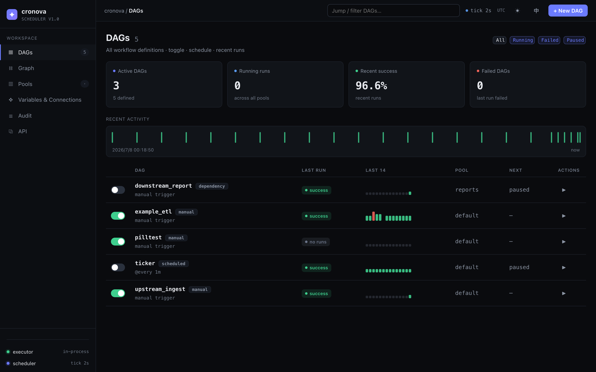

# Dashboard & creating DAGs

The DAGs dashboard is the home screen of the cronova web console (default `http://localhost:8090`) — a single page that shows every workflow definition, its recent health, and its next scheduled run. This page walks through each element of the dashboard and shows how to create a new DAG from a starter template, a cron schedule, or pasted YAML.



On a fresh instance the dashboard shows a "No DAGs yet" hero with a single create button. Once at least one DAG exists you get the full layout: stat cards, activity strip, and the DAG table.

!!! note

    The **+ New DAG** button in the topbar is only shown to `admin` users. Viewers get a read-only dashboard — they can browse everything but cannot create, pause, or trigger DAGs.

## Stat cards

Four cards summarize the whole scheduler at a glance:

| Card | What it shows |
|---|---|
| **Active DAGs** | DAGs that are not paused, with the total number of definitions underneath (`N defined`). |
| **Running runs** | DAG runs currently in the `running` state, across all pools. |
| **Recent success** | Success rate (%) over the recent terminal runs — the same runs drawn in the sparklines. |
| **Failed DAGs** | DAGs whose *most recent* run ended `failed` or `timed out`. |

When **Failed DAGs** is non-zero the card becomes clickable — one click applies the *Failed* filter to the table so you can triage straight from the number.

## Recent activity

The **RECENT ACTIVITY** strip plots the last 24 runs across all DAGs as state-colored ticks on a shared time axis, from the earliest run on the left to *now* on the right. Each tick sits at the run's real start time:

- **Hover** a tick to see the DAG id, run state, duration, and start time.
- **Click** a tick to jump to that run's detail page — see [Runs, logs & recovery](runs-logs.md).

If nothing has run yet, the strip reads "No runs yet".

## Getting-started checklist

Until you hit three milestones, a checklist bar sits above the table:

1. **Create your first DAG**
2. **Trigger a run**
3. **Get a green run** (one successful run)

Each step checks off from real store data, not clicks. The bar hides permanently once all three are done; you can also dismiss it early with the ✕ button.

## The DAG table

Each row is one workflow definition. Click anywhere in a row to open its operation page — see [Working with a DAG](dag.md).

| Column | Contents |
|---|---|
| *(toggle)* | Pause/resume switch. Off = paused: the scheduler stops creating runs for this DAG (manual triggers still work). |
| **DAG** | The DAG id, a trigger-type tag (`scheduled`, `manual`, or `dependency`), and a second line showing the schedule expression — or the owner, or "manual trigger" for unscheduled DAGs. |
| **LAST RUN** | State badge of the most recent run: `success`, `failed`, `running`, `queued`, `timed out`, `cancelled`, … or "no runs". |
| **LAST 14** | Sparkline of the last 14 runs. Color encodes the run state; bar height encodes real run duration, scaled against the slowest recent run on the whole dashboard, so "taller = slower" reads consistently across DAGs. Hover a bar for state and duration. |
| **POOL** | The pool(s) the DAG's tasks run in (comma-separated when tasks use several). See [Graph, pools, variables, audit & API](admin.md). |
| **NEXT** | The next fire time — `in Nm` when under an hour away, `due` when under a minute away, `paused` for paused DAGs, `—` when the DAG has no schedule. |
| **ACTIONS** | ▶ queues a manual run immediately (you get a "Run queued" toast and the row refreshes moments later). |

### Filtering

The filter chips next to the page title narrow the table:

| Chip | Shows |
|---|---|
| **All** | Every DAG. |
| **Running** | DAGs whose latest run is currently `running`. |
| **Failed** | DAGs whose latest run ended `failed` or `timed out`. |
| **Paused** | Paused DAGs. |

The **Filter DAGs…** search box in the topbar additionally narrows by DAG id substring; search and chips combine.

## Create a DAG

Click **+ New DAG** in the topbar. The modal keeps the happy path to two decisions: pick a template, name it, create.

### 1. Pick a starter template

| Template | What you get |
|---|---|
| **Blank** | An empty 0-task shell — add tasks yourself in the [task editor](task-editor.md). |
| **Daily ETL** | A three-step `extract → transform → load` shell pipeline. |
| **Scheduled report** | `fetch → render`, preset with a `0 8 * * *` cron (daily at 08:00). |
| **Fan-out / fan-in** | `start` → two parallel branches → `join`. |

Templates create real, editable shell tasks — the ETL and report templates use `{{ logical_date }}` and `{{ run_id }}` so you can see [template variables](../tutorial/template-variables.md) in action. Picking *Scheduled report* auto-expands the schedule section so its preset cron stays visible and correctable.

### 2. Name it

Enter a **DAG ID** — letters, digits, `_`, `-`, `.`, starting with a letter or digit. The modal validates as you type and flags a duplicate id immediately; **Create** stays disabled until the id is valid. Press ++enter++ to submit.

### 3. Set a schedule (optional)

Click **Schedule & more options** to expand the schedule editor. Three modes:

| Mode | Behavior |
|---|---|
| **Manual** | No schedule — the DAG runs only when triggered by hand, by the API, or by an upstream DAG. |
| **Interval** | `@every N` seconds/minutes/hours — a fixed-interval schedule. |
| **Cron expression** | A standard 5-field cron expression. |

In cron mode, preset chips fill the field with one click — *every minute*, *hourly*, *daily 0:00*, *daily 2:00*, *Mon 0:00* — and the **?** button opens a cron cheat sheet with the field layout, operators, and clickable examples and shortcuts (`@hourly`, `@daily`, `@every 30s`, …).

As you type, a live preview asks the server to compute the **next 3 fire times** and shows them under the editor, with a plain-language gloss for interval and preset schedules ("daily 2:00 — Next: …"). An invalid expression shows an error instead — the console never guesses fire times client-side.

Scheduled modes also expose a **Start date** field. A *Catchup* checkbox is visible but not yet editable from the console — see [Scheduling & catchup](../tutorial/scheduling.md) for how catchup works.

!!! tip

    Nothing here is final. The schedule, start date, and everything else are editable any time later from the DAG's **Settings** tab, and every edit auto-saves — see [Working with a DAG](dag.md).

### Or import YAML

Click **or paste YAML to import…** to switch the modal to a YAML textarea. Paste a full DAG spec:

```yaml
dag_id: my_workflow
schedule: "0 2 * * *"
tasks:
  - id: hello
    command: echo hi
```

**Import** sends it through the exact same parser and validation the REST API uses — the console never re-implements the format. On success you land directly on the new DAG's page. The spec format is documented in the [DAG & Task Reference](../DAG_REFERENCE.md).

### After creation

You land on the DAG's operation page with the template tasks (or a 0-task shell) ready to edit. There is no Save button anywhere — the console persists each edit automatically and shows a **Saved / Saving** badge in the header. Continue with [Working with a DAG](dag.md) and [The task editor](task-editor.md), or follow the [first-DAG tutorial](../tutorial/first-dag.md) end to end.

## Common questions

**Where is the Save button?**
There isn't one. The console auto-saves every DAG edit with a short debounce and shows a *Saved* / *Saving* status badge; a *Fix errors* badge appears instead if the current state can't be persisted.

**What makes a DAG count as "failed" on the dashboard?**
Its most recent run ended `failed` or `timed out`. Both the **Failed DAGs** card and the *Failed* filter chip use this rule.

**Can I create a DAG without a schedule?**
Yes — leave the schedule mode on *Manual* (the default). Run it with the ▶ button, the [REST API or CLI](../CLI.md), or from an upstream DAG via [cross-DAG triggers](../tutorial/cross-dag.md).

**What does "due" in the NEXT column mean?**
The next fire time is less than a minute away — the scheduler will pick it up on its next tick.
