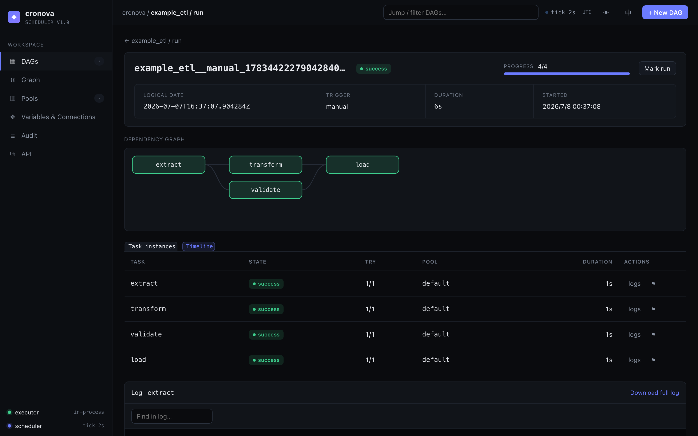

# 运行、日志与恢复

运行页面（`#/run/<run_id>`）用于实时观察单次 DAG 运行的执行过程，并在出现问题时进行恢复——依赖图、各任务实例、流式日志，以及取消 / 重试 / 标记等运维操作，全部集中在 cronova 网页控制台的同一个页面上。

进入此页面的方式：在 DAG 的运行历史中点击任意运行行（参见[使用 DAG](dag.md)），或直接打开 `#/run/<run_id>` URL——运行 URL 是稳定的深链接，可以直接粘贴到告警或聊天会话中。

## 运行头部

页面顶部汇总整个运行的状态，并在执行期间原地更新：

| 元素 | 显示内容 |
|---|---|
| Run id | 等宽字体 id——点击即可复制。 |
| 状态徽标 | 运行的当前状态（`queued`、`running`、`success`、`failed`、`cancelled`、`timed out`），实时变色。 |
| 进度 | `done/total` 计数器加进度条——已进入终态的任务实例数量，任务执行时还会显示 `· N running`。 |
| 逻辑日期 | 本次运行代表的数据区间（点击可复制）——参见[调度与 catchup](../tutorial/scheduling.md)。 |
| 触发方式 | 运行的启动方式：`scheduled`、`manual`、`dependency` 或 `event`。 |
| 时长 | 从开始到结束的墙钟时间；运行进行中会持续递增。 |
| 开始时间 | 第一个任务被派发的时刻。 |

如果运行是带参数触发的，头部下方会有一个药丸栏列出每一对 `key=value`（参见[变量、连接与参数](../tutorial/variables-connections-params.md)）。

头部右侧是运行级操作——运行进行中显示 **Cancel run**，运行结束后显示 **Retry failed** 和 **Mark run**。具体显示哪些按钮取决于运行状态和你的角色；详见下文[恢复一次运行](#恢复一次运行)。

## 依赖图

与 DAG 页面上相同的 DAG 图，但会按任务状态实时着色：每个节点的填充色跟随其任务实例变化，运行中的任务会有脉动效果。随着调度器逐步推进工作流，你可以直观地看到绿色浪潮在图上蔓延——而一个红色节点及其后方灰色的 `upstream failed` 节点会把你直接指向根因。图支持鼠标平移和缩放。

## 任务实例

图的下方有两个标签页，可在实例表格和时间线之间切换。

**Task instances** 标签页为运行中的每个任务列出一行：

| 列 | 含义 |
|---|---|
| task | 任务 id，即 DAG YAML 中定义的名称。 |
| state | 状态徽标：`scheduled`、`queued`、`running`、`retrying`、`success`、`failed`、`upstream failed`、`skipped`、`cancelled`、`timed out`。 |
| try | `n/m`——当前尝试次数 / 最大次数（`max_retries + 1`）。自动重试会递增 `n`；参见[重试、超时与资源池](../tutorial/retries-timeouts-pools.md)。 |
| pool | 任务所在的并发资源池（在[管理页面](admin.md)中管理）。 |
| duration | 任务最近一次尝试窗口的墙钟时间。 |
| actions | **logs** 打开日志面板。运行结束后，**↻** 可重试失败/已取消/超时的任务，**⚑** 可标记任务状态（运维覆写）。 |

**Timeline** 标签页把同样的实例渲染成甘特图：每个任务一根条形，按真实的开始和结束时间定位与定长，按状态着色。悬停条形会显示任务、状态、时长以及开始 → 结束时间；任务名旁的 `×n` 徽标标记出执行了不止一次尝试的任务。从未运行过的任务（如 `skipped` 或 `upstream failed`）显示为灰色标签，而不是伪造一根条形。点击某一行即可打开该任务的日志。

## 日志面板

打开运行页面时，底部的日志面板会自动定位到最有用的任务：优先是当前正在运行的任务，否则是第一个尚未完成的任务，再否则是第一个任务。点击任意行（或时间线的行）上的 **logs** 即可切换任务。

面板提供：

- **实时跟踪**——任务运行期间，其 stdout/stderr 通过 SSE 流入面板，视图自动跟随最新一行。脉动的 *live* 指示器表示流处于打开状态；任务结束后指示器消失。
- **日志内查找**——在过滤框中输入即可只显示匹配的行（不区分大小写），并实时统计匹配数量。
- **下载完整日志**——面板头部的链接可将完整捕获的日志文件下载为 `<task>.log`。

!!! note
    实时视图缓冲最近 5,000 行（被截断时会显示 `showing last 5000 lines` 提示）。**下载完整日志**始终提供完整文件。每次尝试都会写入一份全新的日志文件，因此重试之后面板显示的是当前尝试的输出，而不是所有尝试的拼接。

## 恢复一次运行

cronova 的恢复操作就在运行页面上，且每一次操作都会记录到[审计轨迹](admin.md)中。你能看到哪些操作取决于运行的状态——而 viewer（只读角色）完全看不到任何运维操作：

| 操作 | 位置 | 出现条件 | 作用 |
|---|---|---|---|
| **Cancel run** | 头部 | 运行处于 `queued` 或 `running` | 确认后（"Running tasks will be killed."），杀掉所有正在运行的任务进程，将未完成任务标记为 `cancelled`，并将运行终结为 `cancelled`。 |
| **Retry failed** | 头部 | 运行已结束，且至少有一个 `failed`、`upstream failed`、`cancelled` 或 `timed out` 任务 | 将这些任务*及其下游*重置回 `scheduled` 并重新激活运行。已经成功的任务不会重跑。 |
| **↻ Retry**（单任务） | 实例行 | 运行已结束；任务可重试 | 确认后，重置*该任务及其全部下游任务*并重跑该子树。 |
| **⚑ Mark state**（单任务） | 实例行 | 任何时候（管理员）——对进行中的运行同样有效 | 选择 **success**、**skip** 或 **failed**。仍在运行的任务会先被杀掉。标记为 success/skip 会释放因 `upstream failed` 而被阻塞的下游任务；已结束的运行会被重新激活，由调度器继续推进。 |
| **Mark run** | 头部 | 运行已结束 | 选择 **success** 或 **failed**。仅覆写运行的*记录结果*，不改动任务状态。标记为 success 会触发所有下游 DAG 的触发器，与自然成功完全一致——参见[跨 DAG 触发](../tutorial/cross-dag.md)。 |

!!! tip
    经验法则：想让工作重新执行时用 **Retry**；结果已经处理妥当（你手动修好了，或这次失败无关紧要）、只需要让调度器的账目——以及下游——继续往前走时用 **Mark**。

!!! warning
    单任务的 **↻** 重试会重置该任务的整个下游子树，而不仅仅是这一个任务——确认对话框会明确说明这一点。如果下游任务有你不希望重复执行的副作用，请先检查依赖图。

这里的每个操作也都可以通过 REST API 和 CLI 完成（`cronova cancel`、`cronova retry`、`cronova mark`、`cronova logs`）——参见 [CLI 参考](../CLI.md)。

## 实时刷新与重试的呈现方式

运行进行期间，页面每 2 秒轮询一次并原地更新所有内容——状态徽标、进度条、图节点颜色、实例表格——不会中断已打开的日志流，也不会抢走键盘焦点。当运行进入终态后，轮询停止，并弹出 toast 报告结果。

重试会在三处可见：两次尝试之间状态徽标翻转为 `retrying`，**try** 列递增（`2/3`、`3/3`……），日志面板开始一份新的尝试日志。运维发起的重试会让计数器继续累加而不是清零，因此 try 计数始终如实记录任务实际执行了多少次。

## 常见问题

**为什么我的失败运行上没有 Retry 按钮？**
Retry 只在*已结束*且仍有可重试任务的运行上出现。如果运行显示 `running` 或 `queued`，请先取消。如果所有任务都已成功或被跳过，也就无可重试——需要覆写记录结果时请使用 **Mark run**。

**能只重试一个任务而不重跑整个 DAG 吗？**
可以——点击任务行上的 **↻**。它会重跑该任务及其下游子树；已经成功的上游任务保持不变。

**为什么不能标记一个仍在运行的运行？**
进行中的运行状态由其任务状态推导而来，直接覆写会立刻被覆盖回去。请先取消运行，或改为标记单个任务——任务级标记对进行中的运行有效。

**重试之后我的日志去哪了？**
每次尝试都会开始一份新的日志文件。面板（以及下载链接）显示的是最新一次尝试。

**谁能使用这些操作？**
写操作仅限管理员。viewer 令牌和 viewer 会话只能看到只读的运行页面——没有取消、重试或标记按钮。参见 [API 令牌与角色](admin.md)。
